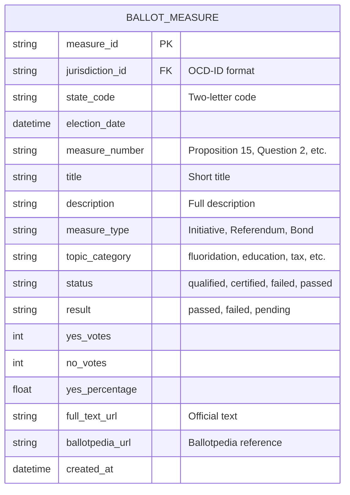

# Ballot Measures & Election Results

Official data sources for tracking ballot initiatives, referendums, propositions, and election outcomes. Essential for monitoring water fluoridation votes, school bond measures, health policy propositions, and other civic engagement opportunities.

## 📊 Data Scale & Coverage

| Data Type | Source | Coverage | Cost |
|-----------|--------|----------|------|
| **Ballot Measures** | Ballotpedia | All states, historical | API limited (paid at scale) |
| **Election Results** | MIT Election Lab | Presidential/Congressional | Free |
| **Certified Results** | OpenElections | State-by-state | Free (CSV) |

---

## 🗳️ Primary Data Sources

### 1. Ballotpedia ⭐ **Most Comprehensive**

**Organization:** Lucy Burns Institute  
**URL:** https://ballotpedia.org/  
**API:** https://ballotpedia.org/API-documentation

**What It Contains:**
- **State ballot measures** - Propositions, referendums, constitutional amendments
- **Local ballot measures** - City/county questions, bond issues, tax levies
- **Initiative campaigns** - Signature gathering, qualification status
- **Election results** - Historical outcomes, vote counts, passage status
- **Full text** - Complete measure language and official summaries
- **Timeline data** - Filing dates, election dates, certification dates

**Coverage:**
- ✅ All 50 states + DC
- ✅ Historical data back to 1990s
- ✅ Local measures in major cities
- ✅ Water fluoridation votes (highly relevant!)
- ✅ School bond measures
- ✅ Tax and spending propositions

**API Access:**
- **Free tier:** Limited queries (suitable for testing)
- **Paid tier:** Full API access required for production scale
- **Alternative:** Web scraping (permitted with rate limiting)

**How We Use It:**
```python
# Example: Find fluoridation ballot measures
import requests

# Ballotpedia search (web scraping approach)
def search_fluoridation_measures(state_code, year):
    """Search for water fluoridation ballot measures"""
    base_url = "https://ballotpedia.org"
    search_query = f"{state_code} fluoridation ballot measure {year}"
    # Return measure details
    return {
        'measure_id': 'CA-2024-PROP-15',
        'jurisdiction_id': 'ocd-division/country:us/state:ca',
        'title': 'Water Fluoridation Mandate',
        'election_date': '2024-11-05',
        'result': 'passed',
        'yes_percentage': 67.2,
        'ballotpedia_url': 'https://ballotpedia.org/...'
    }
```

**Data Model Integration:**
```sql
-- BALLOT_MEASURE entity includes:
ballotpedia_url TEXT  -- Direct link to Ballotpedia page
measure_number TEXT   -- e.g., "Proposition 15", "Question 2"
result TEXT           -- passed, failed, pending
yes_votes INTEGER
no_votes INTEGER
yes_percentage FLOAT
```

**Use Cases:**
- ✅ Track fluoridation votes across all states
- ✅ Monitor school bond elections (dental program funding)
- ✅ Alert advocates when measures qualify for ballot
- ✅ Historical analysis of health policy votes

---

### 2. MIT Election Data + Science Lab

**Organization:** Massachusetts Institute of Technology  
**URL:** https://electionlab.mit.edu/data  
**Repository:** https://github.com/MEDSL/official-returns

**What It Contains:**
- **Presidential election results** (1976-2020) by state and county
- **U.S. Senate election results** (1976-2020)
- **U.S. House election results** (1976-2020)
- **Gubernatorial elections** (1976-2020)
- **County-level results** - Granular vote totals
- **Certified official results** - From Secretaries of State

**Coverage:**
- ✅ Federal elections only (not ballot measures)
- ✅ All 50 states + DC
- ✅ County-level granularity
- ✅ Historical trends (45+ years)
- ✅ 100% free bulk downloads

**Format:**
- **CSV files** - Easy to ingest
- **Standardized schema** - Consistent across states
- **Annual updates** - New elections added promptly

**How We Use It:**
```python
import pandas as pd

# Download county-level presidential results
url = "https://dataverse.harvard.edu/api/access/datafile/4299753"
df = pd.read_csv(url)

# Filter for specific state/county
results = df[
    (df['state'] == 'NORTH CAROLINA') & 
    (df['year'] == 2020)
]

# Join with JURISDICTION data to link elections to jurisdictions
merged = results.merge(
    jurisdictions_df,
    left_on=['state_po', 'county_name'],
    right_on=['state_code', 'county']
)
```

**Data Model Integration:**
```sql
-- Can link to JURISDICTION for context
-- Useful for understanding political climate in each jurisdiction
CREATE TABLE election_results (
    result_id TEXT PRIMARY KEY,
    jurisdiction_id TEXT REFERENCES jurisdictions(jurisdiction_id),
    election_date DATE,
    office TEXT,  -- President, Senate, House, etc.
    candidate TEXT,
    party TEXT,
    votes INTEGER,
    vote_percentage FLOAT
);
```

**Use Cases:**
- ✅ Understand political composition of jurisdictions
- ✅ Correlate election outcomes with policy decisions
- ✅ Identify swing counties for targeted advocacy
- ✅ Historical context for ballot measure success rates

---

### 3. OpenElections ⭐ **Free & Certified**

**Organization:** Open Elections Project  
**URL:** https://openelections.net/  
**GitHub:** https://github.com/openelections

**What It Contains:**
- **State-by-state certified election results**
- **All offices** - Presidential, Congressional, State, Local
- **All election types** - General, Primary, Special, Runoff
- **Precinct-level data** - Highly granular (where available)
- **Official certified results** - Directly from election officials
- **Standardized CSV format** - Easy to parse and analyze

**Coverage:**
- ✅ All 50 states (various completion levels)
- ✅ Presidential elections (nearly complete)
- ✅ Statewide races (good coverage)
- ✅ Local races (partial coverage)
- ⚠️ **Ballot measures coverage varies by state**

**State Coverage Status:**
See: https://github.com/openelections/openelections-data-ok

**Format:**
```csv
county,precinct,office,district,party,candidate,votes
Wake,01-001,President,,DEM,Joe Biden,1234
Wake,01-001,President,,REP,Donald Trump,987
```

**How We Use It:**
```python
import pandas as pd

# Download North Carolina 2020 results
url = "https://raw.githubusercontent.com/openelections/openelections-data-nc/master/2020/20201103__nc__general__precinct.csv"
df = pd.read_csv(url)

# Filter for specific county
wake_results = df[df['county'] == 'Wake']

# Aggregate by jurisdiction
jurisdiction_totals = wake_results.groupby(['office', 'candidate']).agg({
    'votes': 'sum'
}).reset_index()
```

**Data Model Integration:**
```sql
-- Similar to MIT Election Lab, but more granular
CREATE TABLE precinct_results (
    result_id TEXT PRIMARY KEY,
    jurisdiction_id TEXT REFERENCES jurisdictions(jurisdiction_id),
    precinct_id TEXT,
    election_date DATE,
    office TEXT,
    district TEXT,
    party TEXT,
    candidate TEXT,
    votes INTEGER
);
```

**Use Cases:**
- ✅ Precinct-level advocacy targeting
- ✅ Voter turnout analysis
- ✅ Identify competitive jurisdictions
- ✅ Track local races (school board, city council)

**Lakehouse Integration:**
1. **Bronze Layer** - Raw CSV downloads from GitHub
2. **Silver Layer** - Standardized, deduplicated results
3. **Gold Layer** - Aggregated to jurisdiction level with OCD-IDs
4. **Join with JURISDICTION** - Link elections to government entities

---

## 🎯 Fluoridation Vote Tracking (Use Case)

**Goal:** Track all water fluoridation ballot measures across the United States

**Data Sources Combination:**
1. **Ballotpedia** - Identify fluoridation measures, get full text
2. **OpenElections** - Get precinct-level results where available
3. **MIT Election Lab** - County-level context for political analysis

**Example Query:**
```python
# Find all fluoridation votes
fluoridation_measures = ballot_measures_df[
    ballot_measures_df['title'].str.contains('fluorid', case=False, na=False)
]

# Get results
for measure_id in fluoridation_measures['measure_id']:
    results = get_election_results(measure_id)
    # Alert advocates if measure is upcoming
    if results['status'] == 'qualified':
        send_advocacy_alert(measure_id)
```

---

## 📊 Data Availability Summary

| Source | Ballot Measures | Election Results | Historical Data | Cost | Format |
|--------|----------------|------------------|-----------------|------|--------|
| **Ballotpedia** | ✅ Comprehensive | ✅ Yes | ✅ 1990s+ | 💰 API paid | HTML/API |
| **MIT Election Lab** | ❌ No | ✅ Federal only | ✅ 1976+ | ✅ Free | CSV |
| **OpenElections** | ⚠️ Varies by state | ✅ All levels | ✅ State-dependent | ✅ Free | CSV |

**Recommendation:**
- Use **Ballotpedia** for ballot measure discovery and tracking
- Use **OpenElections** for detailed precinct-level results (free)
- Use **MIT Election Lab** for county-level political context (free)

---

## 🔗 Integration with Data Model

### BALLOT_MEASURE Entity



**Data Sources Referenced:**
- `ballotpedia_url` → [Ballotpedia](https://ballotpedia.org/)
- `full_text_url` → State Secretary of State websites
- Election results → [OpenElections](https://openelections.net/) or [MIT Election Lab](https://electionlab.mit.edu/)

---

## 🚀 Implementation Roadmap

### Phase 1: Ballotpedia Integration (Current Priority)
- [ ] Create `scripts/extract_ballotpedia_measures.py`
- [ ] Web scraping with rate limiting (respect robots.txt)
- [ ] Search for fluoridation-related measures
- [ ] Extract measure details and URLs
- [ ] Save to `data/gold/ballots_state_measures.parquet`

### Phase 2: OpenElections Integration
- [ ] Create `scripts/extract_openelections_results.py`
- [ ] Download state CSV files from GitHub
- [ ] Standardize to common schema
- [ ] Link to jurisdictions using OCD-IDs
- [ ] Save to `data/gold/ballots_election_results.parquet`

### Phase 3: MIT Election Lab Integration
- [ ] Download county-level presidential results
- [ ] Join with JURISDICTION data
- [ ] Calculate political composition metrics
- [ ] Use for advocacy targeting

### Phase 4: Real-time Monitoring
- [ ] Set up alerts for newly qualified measures
- [ ] Monitor election certification dates
- [ ] Update results post-election
- [ ] Notify advocates of opportunities

---

## 📚 References & Credits

### Official Sources
- **Ballotpedia** - Lucy Burns Institute, https://ballotpedia.org/
- **MIT Election Data + Science Lab** - https://electionlab.mit.edu/
- **OpenElections** - Open source project, https://openelections.net/

### Open Civic Data Standards
- **OCD Division IDs** - https://github.com/opencivicdata/ocd-division-ids
- **OCDEP 2 Specification** - https://open-civic-data.readthedocs.io/en/latest/proposals/0002.html

### Related Documentation
- [Data Model ERD](./data-model-erd.md) - Full entity relationship diagram
- [Jurisdiction Discovery](./jurisdiction-discovery.md) - How jurisdictions are identified
- [HuggingFace Datasets](./huggingface-datasets.md) - Published datasets catalog

---

## 🤝 Contributing

Have a suggestion for another ballot/election data source? Please contribute!

1. Check if the source is **free and public**
2. Verify data quality and official status
3. Test integration with existing data model
4. Submit a pull request with documentation

**Potential future sources:**
- State Secretary of State APIs
- County election board websites
- Voter information portals
- Campaign finance databases (for measure funding)
