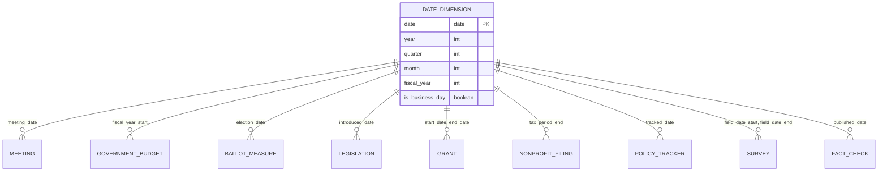

import ZoomableMermaid from '@site/src/components/ZoomableMermaid';

# Data Model & Entity Relationship Diagram

Comprehensive overview of all data entities extracted, processed, and uploaded to HuggingFace datasets.

## � HuggingFace Dataset Structure

### Current Datasets Being Uploaded

```
open-navigator-data/
├── jurisdictions/          # 🏛️ Core jurisdiction data
│   ├── cities              # 19,000+ incorporated places
│   ├── counties            # 3,144 U.S. counties
│   ├── states              # 50 states + DC, territories
│   ├── school_districts    # 13,000+ districts (NCES data)
│   └── census_data         # Basic FIPS codes & census year reference
│
├── demographics/           # 👥 Comprehensive demographic data (U.S. Census)
│   ├── population          # Total population, age distribution
│   ├── race_ethnicity      # Race and ethnicity breakdowns
│   ├── income_economics    # Income, poverty, SNAP benefits
│   ├── education           # Educational attainment levels
│   ├── housing             # Housing units, ownership, values
│   ├── employment          # Unemployment, labor force participation
│   └── health_insurance    # Insurance coverage (uninsured, Medicaid, Medicare)
│
├── social/                 # 📱 Social media presence
│   ├── twitter             # Twitter/X accounts
│   ├── facebook            # Facebook pages
│   ├── instagram           # Instagram accounts
│   └── linkedin            # LinkedIn pages
│
├── videos/                 # 📹 Video & streaming platforms
│   ├── youtube_channels    # Government YouTube channels
│   ├── vimeo              # Vimeo accounts
│   └── livestreams        # Live meeting streams
│
├── platforms/              # 🖥️ Meeting management systems
│   ├── legistar           # Legistar URLs
│   ├── granicus           # Granicus links
│   ├── suiteone           # SuiteOne systems
│   └── civicplus          # CivicPlus platforms
│
├── domains/                # 🌐 Official government websites
│   ├── gsa_domains        # .gov domain registry
│   ├── municipal_websites # City/county websites
│   └── state_portals      # State government sites
│
├── meetings/               # 📋 Meetings, events & trainings
│   ├── government_meetings # City council, school board, etc.
│   ├── public_hearings    # Public comment sessions
│   ├── community_events   # Town halls, forums, engagement
│   ├── trainings          # Professional development, workshops
│   ├── agendas            # Meeting agendas (text extracted)
│   ├── minutes            # Meeting minutes (text extracted)
│   ├── videos             # YouTube/Vimeo video metadata
│   └── documents          # Associated documents
│
├── officials/              # 👥 Elected officials & leaders
│   ├── local_officials    # City/county officials (mayors, councils)
│   ├── state_legislators  # From Open States API
│   └── school_board       # School board members
│
├── nonprofits/             # 🏢 Nonprofit organizations & churches
│   ├── irs_eobmf          # IRS EO-BMF bulk data (1.9M+ organizations) - PRIMARY SOURCE
│   ├── irs_nonprofits     # Legacy IRS 990 data (deprecated - use irs_eobmf)
│   ├── propublica_data    # ProPublica API (financials, NTEE codes)
│   ├── everyorg_data      # Every.org API (missions, causes, logos)
│   ├── nonprofit_990s     # Detailed Form 990 financials (yearly filings)
│   ├── congregations      # 🛐 Church & congregation data (ARDA, HIFLD, NCS)
│   ├── constituents       # 🤝 Donors, volunteers, members, beneficiaries (Microsoft CDM)
│   ├── donations          # 💝 Financial contributions and in-kind gifts (Microsoft CDM)
│   ├── campaigns          # 📣 Fundraising campaigns and appeals (Microsoft CDM)
│   ├── memberships        # 🎫 Member enrollment and renewals (Microsoft CDM)
│   ├── volunteer_activities # 🙋 Volunteer hours and activities (Microsoft CDM)
│   ├── program_delivery   # 🎯 Programs and services delivered (Microsoft CDM)
│   └── program_outcomes   # 📊 Impact metrics and outcome measurements (Microsoft CDM)
│
├── grants/                 # 💵 Grant funding transactions
│   ├── nonprofit_grants   # Grants to nonprofits (from 990 Schedule I)
│   ├── government_grants  # Government grants to orgs/jurisdictions
│   ├── foundation_grants  # Private foundation grants
│   └── federal_grants     # Federal funding programs
│
├── causes/                 # 🎯 Cause & category taxonomy
│   ├── ntee_codes         # IRS NTEE classification system
│   └── everyorg_causes    # Every.org cause tags
│
├── budgets/                # 💰 Government budgets & finances
│   ├── city_budgets       # City/municipal budgets & spending
│   ├── county_budgets     # County budgets & expenditures
│   ├── state_budgets      # State government finances
│   ├── school_budgets     # School district finances (NCES F-33)
│   ├── bond_debt          # Municipal bonds & debt obligations
│   ├── budget_line_items  # 📊 Detailed budget categories & line items
│   └── budget_deltas      # 🔍 Budget-to-Minutes Delta analysis (political economy)
│
├── decisions/              # ⚖️ Policy decisions & political economy analysis
│   ├── policy_decisions   # Extracted decisions from meetings
│   ├── decision_frames    # Frame analysis (rhetoric patterns)
│   ├── decision_options   # Options considered & rejected
│   ├── decision_tradeoffs # Tradeoffs discussed (cost vs benefit, etc.)
│   ├── stakeholder_positions # 👥 Who spoke for/against (Influence Radar)
│   ├── decision_votes     # Detailed vote records per decision
│   ├── deferral_patterns  # 📅 Stalling detection (same topic, multiple deferrals)
│   ├── deferral_instances # Individual tabling events linked to patterns
│   ├── keyword_density    # Quantitative indicators (grant/taxpayer/emergency)
│   └── deferral_patterns  # Tabled/delayed decisions (temporal analysis)
│
├── elections/              # 📅 Election cycles & temporal analysis
│   ├── election_cycles    # Election dates & periods
│   └── election_influences # Pre/post-election decision patterns
│
├── campaigns/              # 💰 Political campaign finance (FEC data)
│   ├── candidates         # Federal candidates (House, Senate, President)
│   ├── committees         # PACs, Super PACs, campaign committees
│   ├── contributions      # Individual political contributions $200+
│   └── nonprofit_donors   # Nonprofit leadership political giving analysis
│
├── civic/                  # 🗳️ Google Civic & Wikidata
│   ├── civic_divisions    # OCD divisions
│   ├── representatives    # From Google Civic API
│   ├── wikidata_entities  # Structured entities
│   └── dbpedia_resources  # Wikipedia infobox data
│
├── ballots/                # 🗳️ Ballot initiatives & referendums
│   ├── state_measures      # State propositions (fluoridation votes!)
│   ├── local_measures      # City/county ballot questions
│   └── election_results    # Historical voting outcomes
│
├── legislation/            # 📜 State & Local Legislative Data (Open States/Plural Policy)
│   ├── legislators         # 7,300+ state legislators (all 50 states + DC, PR)
│   ├── legislator_roles    # Legislative roles (term, district, chamber, party)
│   ├── legislator_offices  # Contact info (district/capitol offices, phone, email)
│   ├── committees          # Legislative committees (standing, select, joint)
│   ├── committee_memberships # Legislator committee assignments & roles
│   ├── legislative_sessions # Session identifiers, years, special sessions
│   ├── bills               # State bills with full text (100K+ bills from 2020+)
│   ├── bill_sponsors       # Primary sponsors & co-sponsors per bill
│   ├── bill_subjects       # Bill topic classification
│   ├── bill_actions        # Bill history (introduced, committee, floor, signed)
│   ├── bill_versions       # Different versions of bill text (as introduced, amended, enacted)
│   ├── votes               # Roll call votes on bills & amendments
│   ├── vote_events         # Vote metadata (date, chamber, motion, result)
│   ├── legislator_votes    # Individual legislator positions (yes/no/abstain/absent)
│   ├── local_ordinances    # Municipal codes & resolutions
│   └── policy_tracking     # Bill status & outcomes
│
├── topics/                 # 🎯 Advocacy causes & campaigns
│   ├── topic_definitions   # Validated survey questions from Roper Center
│   ├── survey_questions    # Public opinion question wording library
│   ├── jurisdiction_topics # What each city is discussing
│   └── advocacy_alerts     # Opportunities for engagement
│
├── surveys/                # 📊 Public opinion research & polling data
│   ├── survey_providers    # Polling organizations (Gallup, Pew, Roper, etc.)
│   ├── survey_studies      # Individual survey studies/waves
│   ├── survey_variables    # Questions/items asked in surveys
│   ├── survey_responses    # Aggregate and individual response data
│   ├── ipoll_metadata      # Roper iPoll catalog metadata
│   └── survey_crosstabs    # Breakdowns by demographics, geography
│
├── factchecks/             # ✅ Fact-checking & claim verification
│   ├── claim_reviews       # Google Fact Check API (ClaimReview schema)
│   ├── politifact          # PolitiFact Truth-O-Meter ratings
│   ├── factcheck_org       # FactCheck.org verified claims
│   └── verified_claims     # Aggregated fact-check database
│
├── civic_tech/             # 💻 Open source projects & hackathons
│   ├── github_repositories # Civic tech projects (GitHub API)
│   ├── project_metadata    # Code for America, USDR, Civic Tech Field Guide
│   ├── contributors        # Maintainers and core contributors
│   ├── project_issues      # Good first issues, contribution opportunities
│   ├── hackathons          # Civic hackathon events
│   ├── hackathon_projects  # Projects built at hackathons
│   ├── brigade_chapters    # Code for America brigade locations
│   └── project_funding     # GitHub Sponsors, grants, OpenCollective
│
├── community_solutions/    # 🌟 Community engagement & use cases
│   ├── engagement_spectrum # Spectrum of Community Engagement to Ownership
│   ├── use_case_catalog   # Harvard Data-Smart City Solutions examples
│   ├── data_academies     # Brookings Institution training programs
│   ├── success_stories    # Real-world outcomes (Providence, Portland, Tempe)
│   ├── metric_templates   # Pre-built analytics for common challenges
│   └── workflow_guides    # Step-by-step community data workflows
│
├── analytics/              # 📊 Time dimensions & metric views
│   ├── date_dimension      # Date/time reference table (YYYY-MM-DD, day_of_week, fiscal_year)
│   ├── temporal_relationships  # Time-series joins for all entities
│   ├── metric_views        # Pre-computed analytics (advocacy, spending, nonprofit impact)
│   ├── aggregated_stats    # Monthly/quarterly/yearly rollups
│   └── dashboard_metrics   # Real-time dashboard data feeds
│
├── standards/              # 🌐 Schema.org, Popolo, CEDS, IATI exports
│   ├── schema_org_jsonld   # JSON-LD exports (Event, Person, Organization, Legislation, ClaimReview)
│   ├── popolo_exports      # Popolo-compliant JSON (Person, Organization, Membership, VoteEvent)
│   ├── ceds_aligned        # CEDS-compliant education data (Element IDs, Option Sets)
│   ├── ocd_divisions       # Open Civic Data division IDs
│   ├── iati_activities     # IATI Standard v2.03 XML (programs, grants, humanitarian aid)
│   └── rdf_triples         # RDF/Turtle semantic web exports
│
├── vocabulary/             # 🔧 OMOP-inspired concept & terminology (SYSTEM-INTERNAL)
│   ├── concept             # Master concept table (cities, causes, officials)
│   ├── vocabulary          # Vocabulary sources (OCD_ID, IRS_NTEE, US_Census)
│   ├── concept_class       # Concept classifications (City, County, 501c3, Mayor)
│   ├── concept_relationship # Relationships (City → County, Topic → Legislation)
│   └── domain              # Domain groupings (Jurisdiction, Nonprofit, Policy)
│
└── exports/                # 📤 API-ready formatted exports
    ├── csv_bulk            # CSV downloads for all datasets
    ├── json_api            # REST API JSON responses
    ├── graphql_schema      # GraphQL schema definitions
    └── parquet_optimized   # Compressed Parquet (default format)
```

### Parquet File Naming Convention

**Rule:** Use underscores (`_`) consistently, NOT hyphens (`-`)

**Format:** `{category}_{subcategory}.parquet`

**Examples:**
```
✅ CORRECT (using underscores):
jurisdictions_cities.parquet
jurisdictions_counties.parquet
jurisdictions_states.parquet
jurisdictions_school_districts.parquet
social_twitter.parquet
social_facebook.parquet
videos_youtube_channels.parquet
meetings_government_meetings.parquet
nonprofits_organizations.parquet
nonprofits_financials.parquet
nonprofits_programs.parquet
nonprofits_locations.parquet
nonprofits_irs_eobmf.parquet
nonprofits_constituents.parquet
nonprofits_donations.parquet
nonprofits_campaigns.parquet        # Nonprofit fundraising campaigns (NOT political)
campaigns_candidates.parquet        # Political candidates (FEC)
campaigns_committees.parquet        # Political committees/PACs (FEC)
campaigns_contributions.parquet     # Political contributions (FEC)
campaigns_nonprofit_donors.parquet  # Nonprofit leadership political giving (FEC analysis)
nonprofits_memberships.parquet
nonprofits_volunteer_activities.parquet
nonprofits_program_delivery.parquet
nonprofits_program_outcomes.parquet
grants_federal_grants.parquet
legislation_legislators.parquet
legislation_legislator_roles.parquet
legislation_legislator_offices.parquet
legislation_committees.parquet
legislation_committee_memberships.parquet
legislation_legislative_sessions.parquet
legislation_bills.parquet
legislation_bill_sponsors.parquet
legislation_bill_subjects.parquet
legislation_bill_actions.parquet
legislation_bill_versions.parquet
legislation_votes.parquet
legislation_vote_events.parquet
legislation_legislator_votes.parquet
legislation_local_ordinances.parquet
legislation_policy_tracking.parquet
budgets_city_budgets.parquet
surveys_national_polls.parquet
surveys_roper_questions.parquet
surveys_survey_providers.parquet
surveys_survey_studies.parquet
surveys_survey_variables.parquet
surveys_survey_responses.parquet
surveys_ipoll_metadata.parquet
factchecks_claim_reviews.parquet
factchecks_politifact.parquet
analytics_date_dimension.parquet
analytics_metric_views.parquet
analytics_temporal_relationships.parquet
standards_schema_org_jsonld.parquet
standards_popolo_exports.parquet
standards_ceds_aligned.parquet
standards_iati_activities.parquet
vocabulary_concept.parquet
vocabulary_vocabulary.parquet
vocabulary_concept_class.parquet
vocabulary_concept_relationship.parquet

❌ INCORRECT (using hyphens):
jurisdictions-cities.parquet
social-twitter.parquet
meetings-government-meetings.parquet
surveys-national-polls.parquet
factchecks-claim-reviews.parquet
analytics-date-dimension.parquet
standards-schema-org.parquet
```

**Why Underscores?**
- ✅ Python-friendly variable names (can use `data.jurisdictions_cities`)
- ✅ SQL-compatible column names
- ✅ Consistent with folder structure (`school_districts`, not `school-districts`)
- ✅ Better for programmatic access
- ✅ Avoids shell escaping issues

**Repository Name Exception:**
- HuggingFace repo: `CommunityOne/open-navigator-data` (hyphen is fine for URLs)
- File names inside repo: Use underscores (`jurisdictions_cities.parquet`)

## 🔄 Data Extraction Pipeline

### Phase 1: Discovery (Bronze Layer)
1. **Census Data** → Jurisdictions list
2. **GSA Domains** → Government websites
3. **NCES** → School districts with financial data (F-33 forms)
4. **IRS EO-BMF** → ALL 1.9M+ U.S. tax-exempt organizations (PRIMARY SOURCE)
5. **IRS TEOS** → Legacy nonprofit EINs (deprecated - use IRS EO-BMF)
6. **Census of Governments** → Municipal budgets & finances
7. **URL Discovery** → Meeting platforms, YouTube, budget PDFs
8. **Social Media** → Twitter, Facebook accounts

### Phase 2: Enrichment (Silver Layer)
1. **IRS EO-BMF** → Complete nonprofit registry with 28 data fields per organization
2. **ProPublica Nonprofit Explorer** → Enhanced financial data, detailed 990 filings
3. **Every.org API** → Nonprofit causes, missions, logos
3. **ARDA (Association of Religion Data Archives)** → Congregation characteristics, health ministries
4. **HIFLD Places of Worship** → Geospatial church locations (350K+ congregations)
5. **National Congregations Study** → Social service provision patterns
6. **NCES F-33 Finance Survey** → School district budgets, per-pupil spending
7. **Census Annual Survey** → State/local government finances
8. **Municipal Securities Rulemaking Board (EMMA)** → Bond debt data
9. **YouTube API** → Channel statistics
10. **Open States PostgreSQL Database** → Complete legislative data (~10 GB monthly dump)
    - **7,300+ state legislators** across all 50 states + DC + Puerto Rico
    - **100,000+ bills** with full text from 2020+
    - **Committee assignments** for all legislators
    - **Roll call votes** on all bills with individual legislator positions
    - **Bill sponsorships** (primary sponsors and co-sponsors)
    - **Bill actions** (committee referrals, amendments, floor votes, signing)
    - **Multiple bill versions** (as introduced, committee substitute, enrolled)
    - **Legislator offices** (district and capitol contact info)
    - **Party affiliations** and term history
    - Updated monthly from https://data.openstates.org/postgres/monthly/
11. **Wikidata SPARQL** → Entity relationships
12. **DBpedia** → Wikipedia structured data
13. **Google Civic** → Representatives
14. **OpenFEC API** → Political contributions, candidates, committees (campaign finance)
15. **GitHub API** → Civic tech projects, contributors, issues
16. **Civic Tech Field Guide** → Curated project taxonomy
17. **Code for America** → Brigade projects and hackathons
18. **Digital Public Goods Alliance** → DPG-certified open source projects

### Phase 3: Processing (Gold Layer)
1. **Meeting Extraction** → Agenda/minutes text
2. **Video Transcripts** → YouTube captions
3. **Document Analysis** → Keyword detection
4. **Relationship Mapping** → Entity connections
5. **Oral Health Filtering** → Topic classification
6. **Temporal Indexing** → Date dimension table, time-series relationships
7. **Metric View Creation** → Pre-computed analytics (advocacy activity, government spending, nonprofit impact)
8. **Schema.org JSON-LD** → Structured data exports (Event, Person, Organization, Legislation, ClaimReview)
9. **Popolo Compliance** → Open government standard exports (Person, Organization, Membership, VoteEvent)
10. **CEDS Alignment** → Education data mapping to NCES Element IDs and Option Sets

### New Dataset Categories Explained

#### 📊 Analytics Datasets

**Purpose:** Enable time-series analysis, trend detection, and dashboard metrics without complex SQL queries.

| Dataset | Description | Refresh Frequency |
|---------|-------------|-------------------|
| `analytics_date_dimension` | Calendar reference table with fiscal years, quarters, day-of-week, holidays | Static (updated annually) |
| `analytics_temporal_relationships` | Pre-joined date keys for all time-based entities (meetings, votes, budgets, filings) | Daily |
| `analytics_metric_views` | Pre-computed analytics like advocacy_activity, government_spending, nonprofit_impact | Hourly |
| `analytics_aggregated_stats` | Monthly/quarterly/yearly rollups (meeting counts, budget totals, grant sums) | Daily |
| `analytics_dashboard_metrics` | Real-time feeds for dashboards (active meetings today, trending topics, hot ballot measures) | Every 5 minutes |

**Example Use Case:**
```sql
-- Instead of complex joins, use metric view:
SELECT * FROM analytics_metric_views 
WHERE metric_name = 'advocacy_activity' 
  AND jurisdiction_id = 'ocd-division/country:us/state:al/place:birmingham'
  AND date_period = '2024-Q1';
```

#### 🌐 Standards-Compliant Exports

**Purpose:** Maximum interoperability with civic tech platforms, search engines, and semantic web tools.

| Dataset | Standard | Use Case | Consumers |
|---------|----------|----------|-----------|  
| `standards_schema_org_jsonld` | Schema.org JSON-LD | Google Search rich results, voice assistants | Google, Bing, Alexa, Siri |
| `standards_popolo_exports` | Popolo Project | Civic tech platform integration | mySociety, OpenNorth, Sunlight Foundation |
| `standards_ceds_aligned` | Common Education Data Standards | Education data exchange, NCES reporting | State education depts, Ed-Fi, IMS Global |
| `standards_ocd_divisions` | Open Civic Data IDs | Cross-platform jurisdiction referencing | Google Civic, Ballotpedia, Vote Smart |
| `standards_rdf_triples` | RDF/Turtle | Linked open data, knowledge graphs | DBpedia, Wikidata, SPARQL endpoints |

**Example Schema.org Export:**
```json
{
  "@context": "https://schema.org",
  "@type": "GovernmentOrganization",
  "name": "Birmingham City Council",
  "address": {
    "@type": "PostalAddress",
    "addressLocality": "Birmingham",
    "addressRegion": "AL"
  },
  "event": [{
    "@type": "Event",
    "name": "Regular City Council Meeting",
    "startDate": "2024-01-15T18:00:00-06:00"
  }]
}
```

#### ✅ Fact-Checking Datasets

**Purpose:** Verify claims made in meetings, legislation, and political speech.

| Dataset | Source | Fields | Update Frequency |
|---------|--------|--------|------------------|
| `factchecks_claim_reviews` | Google Fact Check API | claimReviewed, reviewRating, author, datePublished | Daily |
| `factchecks_politifact` | PolitiFact web scraping | claim, ruling, truth_o_meter, context | Daily |
| `factchecks_factcheck_org` | FactCheck.org API/scraping | claim, verdict, analysis, sources | Daily |
| `factchecks_verified_claims` | Aggregated + deduplicated | claim_text, consensus_rating, verification_sources | Daily |

**Integration with Meetings:**
- Cross-reference meeting transcripts with verified claims
- Flag unverified statements in legislative debates
- Track politician accuracy scores over time

## �📊 Complete Data Model (ERD)

<ZoomableMermaid 
  title="Interactive Entity Relationship Diagram"
  value={`
erDiagram
    %% ========================================
    %% CORE JURISDICTION ENTITIES
    %% ========================================
    %% Schema.org type: AdministrativeArea
    %% OCD-ID format: ocd-division/country:us/state:al/place:birmingham
    
    JURISDICTION ||--o{ MEETING : hosts
    JURISDICTION ||--o{ LEADER : employs
    JURISDICTION ||--o{ YOUTUBE_CHANNEL : operates
    JURISDICTION ||--o{ SOCIAL_MEDIA : maintains
    JURISDICTION ||--o{ MEETING_PLATFORM : uses
    JURISDICTION {
        string jurisdiction_id PK
        string name
        string jurisdiction_type
        string state_code
        string county_name
        string website_url
        float latitude
        float longitude
        string fips_code
        int completeness_score
        datetime discovered_at
    }
    
    %% Census and Government Data
    JURISDICTION ||--o| CENSUS_DATA : has
    CENSUS_DATA {
        string jurisdiction_id PK
        string county_fips
        string place_fips
        datetime census_year
    }
    
    JURISDICTION ||--o| GSA_DOMAIN : uses
    GSA_DOMAIN {
        string domain PK
        string jurisdiction_id FK
        string domain_type
        string agency_name
        string organization_type
        string city
        string state
        datetime created_date
    }
    
    %% Government Finances
    JURISDICTION ||--o{ GOVERNMENT_BUDGET : has
    GOVERNMENT_BUDGET {
        string budget_id PK
        string jurisdiction_id FK
        int fiscal_year
        float total_revenue
        float total_expenditures
        float total_debt
        float property_tax_revenue
        float sales_tax_revenue
        float federal_grants
        float state_grants
        float general_fund_balance
        string budget_document_url
        datetime published_date
    }
    
    %% ========================================
    %% SCHOOL DISTRICTS (NCES)
    %% ========================================
    %% Based on CEDS (Common Education Data Standards) and NCES data elements
    %% See: https://ceds.ed.gov/ and https://github.com/CEDStandards
    %% Schema.org type: EducationalOrganization
    
    JURISDICTION ||--o{ SCHOOL_DISTRICT : contains
    SCHOOL_DISTRICT ||--o{ LEADER : governed_by
    SCHOOL_DISTRICT {
        string nces_id PK
        string district_name
        string jurisdiction_id FK
        string state_code
        string county_name
        string district_type
        int total_students
        int total_schools
        float total_revenue
        float total_expenditures
        float per_pupil_spending
        float federal_revenue
        float state_revenue
        float local_revenue
        string phone
        string website
        string superintendent
        datetime school_year
    }
    
    %% ========================================
    %% MEETINGS & DOCUMENTS
    %% ========================================
    %% Schema.org types: Event, VideoObject, DigitalDocument
    
    MEETING ||--o{ AGENDA : contains
    MEETING ||--o{ MINUTES : produces
    MEETING ||--o{ VIDEO : recorded_as
    MEETING ||--o{ DOCUMENT : references
    MEETING {
        string meeting_id PK
        string jurisdiction_id FK
        string meeting_type
        string event_category
        datetime meeting_date
        datetime end_date
        string meeting_title
        string body_name
        string status
        string platform
        string source_url
        boolean oral_health_related
        string training_topic
        string target_audience
        string presenter
        boolean requires_registration
        float registration_fee
        int max_capacity
        string location_type
        datetime extracted_at
    }
    
    AGENDA {
        string agenda_id PK
        string meeting_id FK
        string title
        string full_text
        string pdf_url
        int page_count
        string keywords_found
        datetime published_at
    }
    
    MINUTES {
        string minutes_id PK
        string meeting_id FK
        string full_text
        string pdf_url
        string summary_text
        string action_items
        string votes
        datetime approved_at
    }
    
    VIDEO {
        string video_id PK
        string meeting_id FK
        string platform
        string video_url
        string thumbnail_url
        int duration_seconds
        int view_count
        string transcript_text
        datetime published_at
    }
    
    DOCUMENT {
        string document_id PK
        string meeting_id FK
        string document_type
        string title
        string content_text
        string file_url
        string file_type
        int file_size_bytes
        datetime uploaded_at
    }
    
    %% ========================================
    %% POLITICAL ECONOMY ANALYSIS
    %% ========================================
    %% Entities supporting the 4-step advocacy framework:
    %%   Step 1: Rhetoric Gap (Frame Analysis)
    %%   Step 2: Displacement Matrix (Budget Delta)
    %%   Step 3: Influence Radar (Stakeholder Analysis)
    %%   Step 4: Deferral Pattern (Temporal Voting Analysis)
    %% See: extraction/decision_analyzer.py, extraction/budget_analyzer.py
    
    MEETING ||--o{ POLICY_DECISION : produces
    POLICY_DECISION ||--o{ DECISION_FRAME : framed_as
    POLICY_DECISION ||--o{ DECISION_OPTION : considered
    POLICY_DECISION ||--o{ DECISION_TRADEOFF : discussed
    POLICY_DECISION ||--o{ STAKEHOLDER_POSITION : influenced_by
    POLICY_DECISION ||--o{ DECISION_VOTE : voted_on
    POLICY_DECISION {
        string decision_id PK
        string meeting_id FK
        string decision_summary
        string outcome "approved/rejected/tabled/amended"
        string chosen_option
        string primary_frame "Economic Development/Public Safety/Equity"
        string primary_rationale
        string vote_result "5-2/unanimous/voice vote"
        int contention_score "0-100: Ratio of dissent"
        string implementation_timeline
        string cost_estimate
        float confidence_score
        datetime meeting_date
        datetime extracted_at
    }
    
    %% STEP 1: RHETORIC GAP - Frame Analysis
    DECISION_FRAME {
        string frame_id PK
        string decision_id FK
        string frame_type "primary/competing"
        string frame_name "public health/fiscal responsibility/equity"
        string framing_language "Specific phrases used"
        int mention_count
    }
    
    DECISION_OPTION {
        string option_id PK
        string decision_id FK
        string option_description
        boolean was_chosen
        string rejection_reason
        string opportunity_cost
    }
    
    DECISION_TRADEOFF {
        string tradeoff_id PK
        string decision_id FK
        string tradeoff_type "cost vs benefit/autonomy vs community"
        string discussion_text
        string evidence_cited
    }
    
    %% STEP 3: INFLUENCE RADAR - Stakeholder Analysis
    STAKEHOLDER_POSITION {
        string position_id PK
        string decision_id FK
        string stakeholder_name
        string stakeholder_role "Health Dept/PTA/Taxpayer Assoc"
        string stakeholder_affiliation
        string position_type "supporter/opponent/undecided"
        string main_argument
        string evidence_type "study/expert opinion/data"
        int speaking_order "Track who speaks when"
    }
    
    %% STEP 4: DEFERRAL PATTERN - Temporal Voting Analysis
    DECISION_VOTE {
        string vote_record_id PK
        string decision_id FK
        string leader_id FK
        string vote_value "yes/no/abstain/absent"
        string stated_reason
        boolean switched_position
        int days_since_election "Temporal context"
    }
    
    %% Deferral Pattern Tracking - Links same topic across multiple meetings
    POLICY_DECISION ||--o{ DEFERRAL_INSTANCE : part_of
    DEFERRAL_PATTERN ||--o{ DEFERRAL_INSTANCE : tracks
    DEFERRAL_PATTERN {
        string pattern_id PK
        string topic "Community Dental Clinic Funding"
        string conclusion "Strategic delay or genuine study"
        datetime first_mentioned "When first introduced"
        datetime last_discussed "Most recent tabling"
        int total_deferrals "How many times tabled"
        int months_in_limbo "Time since first mention"
        string pattern_type "Rationale of Attrition/Sincere Analysis/Political Timing"
        string strategic_inference "Waiting for momentum to fade"
        int discomfort_score "1-10: Political sensitivity"
        string next_review_date "When scheduled to revisit"
        boolean still_pending
    }
    
    DEFERRAL_INSTANCE {
        string instance_id PK
        string pattern_id FK
        string decision_id FK
        datetime deferral_date
        string stated_reason "More study needed/Budget constraints/Public input"
        string speaker "Who gave the justification"
        int months_since_first "Time elapsed"
        string previous_reason "What they said last time"
        boolean reason_changed "Shifting justifications"
    }
    
    %% STEP 2: DISPLACEMENT MATRIX - Budget-to-Minutes Delta
    GOVERNMENT_BUDGET ||--o{ BUDGET_LINE_ITEM : contains
    BUDGET_LINE_ITEM ||--o{ BUDGET_DELTA : analyzed_as
    BUDGET_LINE_ITEM {
        string line_item_id PK
        string budget_id FK
        string category "Education/Health/Infrastructure"
        string subcategory
        string description
        float current_amount
        float previous_amount
        float change_amount
        float percent_change
        string funding_source "grants/taxpayer/bonds"
        int fiscal_year
    }
    
    BUDGET_DELTA {
        string delta_id PK
        string line_item_id FK
        int meeting_mentions "How many times discussed"
        string praise_level "High/Medium/Low/None"
        string funding_change "Expansion/Stagnant/Decreased"
        string delta_type "Expansion/Lip Service/Hidden Priority/Aligned"
        float delta_score "-1 to +1: rhetoric vs reality gap"
        string stated_rationale "What they said in meetings"
        string inferred_rationale "What budget reveals"
        string underlying_logic "Genuine/Performative/Bureaucratic"
        datetime analyzed_at
    }
    
    %% QUANTITATIVE INDICATORS
    MEETING ||--o{ KEYWORD_DENSITY : measured_by
    KEYWORD_DENSITY {
        string density_id PK
        string meeting_id FK
        string keyword "grant/taxpayer/emergency/equity"
        string keyword_category "funding_source/urgency/values"
        int occurrence_count
        float per_1000_words
        datetime analyzed_at
    }
    
    %% ELECTION CYCLE ANALYSIS
    JURISDICTION ||--o{ ELECTION_CYCLE : holds
    ELECTION_CYCLE ||--o{ POLICY_DECISION : influences
    ELECTION_CYCLE {
        string election_id PK
        string jurisdiction_id FK
        datetime election_date
        string election_type "municipal/school board/state"
        int decisions_12mo_before
        int decisions_6mo_before
        int decisions_3mo_before
        int decisions_6mo_after
        float avg_project_cost_before
        float avg_project_cost_after
        boolean pre_election_spike_detected
        string inference "incumbency protection/normal variance"
    }
    
    %% ========================================
    %% LEADERS & OFFICIALS
    %% ========================================
    %% Based on Popolo Project schema for representing people and positions
    %% See: https://github.com/popolo-project/popolo-spec
    %% Schema.org types: Person, GovernmentOfficial
    
    LEADER ||--o{ VOTE : casts
    LEADER ||--o{ SOCIAL_MEDIA : maintains
    LEADER {
        string leader_id PK
        string jurisdiction_id FK
        string full_name
        string title
        string position_type
        string office
        string party_affiliation
        string email
        string phone
        string website
        string photo_url
        datetime term_start
        datetime term_end
        boolean is_active
        datetime verified_at
    }
    
    VOTE {
        string vote_id PK
        string leader_id FK
        string meeting_id FK
        string item_description
        string vote_value
        datetime vote_date
    }
    
    %% ========================================
    %% STATE LEGISLATORS & LEGISLATIVE DATA (Open States/Plural Policy)
    %% ========================================
    %% Data Source: Open States PostgreSQL dump (~10 GB)
    %% Coverage: 7,300+ state legislators across all 50 states + DC + Puerto Rico
    %% See: https://open.pluralpolicy.com/data/ and https://github.com/openstates/people/blob/master/schema.md
    %% Schema.org types: Person, GovernmentOfficial, Legislation, VoteAction
    %% Popolo Project compliance: https://www.popoloproject.com/
    
    JURISDICTION ||--o{ LEGISLATOR : represents
    LEGISLATOR ||--o{ LEGISLATOR_OFFICE : has
    LEGISLATOR ||--o{ COMMITTEE_MEMBERSHIP : serves_on
    LEGISLATOR ||--o{ BILL_SPONSOR : sponsors
    LEGISLATOR ||--o{ LEGISLATOR_VOTE : casts
    LEGISLATOR ||--o{ SOCIAL_MEDIA : maintains
    LEGISLATOR {
        string legislator_id PK "ocd-person/{uuid}"
        string jurisdiction_id FK "ocd-division/country:us/state:al"
        string full_name
        string given_name "First name"
        string family_name "Last name"
        string middle_name
        string suffix
        string gender "Male/Female/Other"
        string email "Official email"
        string biography "Official bio text"
        string birth_date "YYYY-MM-DD"
        string death_date "YYYY-MM-DD"
        string image_url "Official photo"
        string twitter_handle "@username"
        string youtube_handle
        string instagram_handle
        string facebook_handle
        string party_name "Democratic/Republican/Independent"
        datetime party_start_date
        datetime party_end_date
        string chamber "upper/lower/legislature"
        string district "District name/number"
        datetime term_start_date
        datetime term_end_date
        string end_reason "resignation/death/term_limit/defeated"
        string website_url
        boolean is_active
        datetime last_updated
    }
    
    LEGISLATOR_OFFICE {
        string office_id PK
        string legislator_id FK
        string office_type "District Office/Capitol Office"
        string address "Mailing address"
        string voice "Phone number"
        string fax "Fax number"
        string email "Office email"
        string city
        string state
        string zip_code
        boolean is_primary
    }
    
    COMMITTEE ||--o{ COMMITTEE_MEMBERSHIP : includes
    COMMITTEE {
        string committee_id PK "ocd-organization/{uuid}"
        string jurisdiction_id FK
        string name "Committee on Health and Human Services"
        string chamber "upper/lower/legislature"
        string classification "committee/subcommittee"
        string parent_committee_id FK "If subcommittee"
        datetime created_date
        datetime abolished_date
        boolean is_active
    }
    
    COMMITTEE_MEMBERSHIP {
        string membership_id PK
        string committee_id FK
        string legislator_id FK
        string role "chair/vice_chair/ranking_member/member"
        datetime start_date
        datetime end_date
        boolean is_active
    }
    
    BILL ||--o{ BILL_SPONSOR : has
    BILL ||--o{ BILL_ACTION : tracked_by
    BILL ||--o{ BILL_VERSION : has_versions
    BILL ||--o{ VOTE_EVENT : subject_of
    BILL {
        string bill_id PK "ocd-bill/{uuid}"
        string jurisdiction_id FK
        string session_id "2024 Regular Session"
        string chamber "upper/lower"
        string identifier "HB 123/SB 456"
        string title "An Act to provide dental screenings in schools"
        string classification "bill/resolution/concurrent_resolution"
        string subject "Health/Education/Budget"
        string full_text "Complete bill text"
        string summary "Bill summary"
        datetime introduced_date
        datetime first_reading_date
        datetime second_reading_date
        datetime third_reading_date
        datetime committee_referral_date
        string committee_assigned
        datetime committee_vote_date
        string committee_outcome "favorable/unfavorable"
        datetime floor_vote_date
        string floor_outcome "passed/failed"
        datetime signed_date
        datetime effective_date
        string status "introduced/committee/floor/passed/failed/signed/vetoed"
        string source_url "Link to official bill text"
        datetime last_action_date
        string last_action_description
        boolean is_oral_health_related
        datetime created_at
        datetime updated_at
    }
    
    BILL_SPONSOR {
        string sponsor_id PK
        string bill_id FK
        string legislator_id FK
        string sponsor_type "primary/cosponsor"
        int sponsor_order "1 for primary, 2+ for cosponsors"
        datetime sponsored_date
    }
    
    BILL_ACTION {
        string action_id PK
        string bill_id FK
        datetime action_date
        string action_description "Referred to Committee on Health"
        string action_type "introduction/referral/committee/amendment/vote/signing"
        string chamber "upper/lower"
        int sequence_number
    }
    
    BILL_VERSION {
        string version_id PK
        string bill_id FK
        string version_name "As Introduced/Committee Substitute/Enrolled"
        string full_text "Complete version text"
        string pdf_url
        datetime version_date
        string note "Amendments adopted"
    }
    
    VOTE_EVENT ||--o{ LEGISLATOR_VOTE : includes
    VOTE_EVENT {
        string vote_event_id PK "ocd-vote/{uuid}"
        string bill_id FK
        string jurisdiction_id FK
        string chamber "upper/lower"
        datetime vote_date
        string motion_text "Passage of HB 123"
        string motion_classification "passage/amendment/procedural"
        string result "passed/failed"
        int yes_count
        int no_count
        int abstain_count
        int absent_count
        int not_voting_count
        int total_count
        float pass_threshold "0.5 for simple majority, 0.67 for supermajority"
        boolean passed
        string source_url "Link to official vote record"
    }
    
    LEGISLATOR_VOTE {
        string legislator_vote_id PK
        string vote_event_id FK
        string legislator_id FK
        string vote_position "yes/no/abstain/absent/not_voting/excused"
        string voter_name "Name at time of vote"
        string voter_party "Party at time of vote"
        string voter_district "District at time of vote"
    }
    
    %% ========================================
    %% ORGANIZATIONS (NONPROFITS & CHURCHES)
    %% ========================================
    %% Based on Popolo Project schema for organizations
    %% See: https://github.com/popolo-project/popolo-spec
    %% Schema.org types: Organization, NGO, Church, WorshipPlace
    %% PRIMARY DATA SOURCE: IRS EO-BMF (1.9M+ organizations, 28 fields)
    
    ORGANIZATION ||--o{ SOCIAL_MEDIA : maintains
    ORGANIZATION ||--o{ LEADER : employs
    ORGANIZATION ||--o{ NONPROFIT_FINANCES : files
    ORGANIZATION ||--o{ CAMPAIGN : runs
    ORGANIZATION ||--o{ PROGRAM_DELIVERY : delivers
    ORGANIZATION ||--o{ CONGREGATION : has
    ORGANIZATION {
        string org_id PK
        string ein "Employer ID Number (IRS EO-BMF)"
        string name "Organization legal name (IRS EO-BMF)"
        string sort_name "Alphabetic sort name (IRS EO-BMF)"
        string ntee_code "NTEE classification (IRS EO-BMF)"
        string ntee_description
        string subsection_code "501(c)(3) = 03, etc (IRS EO-BMF)"
        string foundation_code "15=Public Charity, etc (IRS EO-BMF)"
        string organization_code "1=Corporation, 2=Trust (IRS EO-BMF)"
        string deductibility_status "1=Deductible (IRS EO-BMF)"
        string exempt_status_code "1=Unconditional (IRS EO-BMF)"
        string causes "Every.org tags"
        string org_type
        string state_code "2-letter state (IRS EO-BMF)"
        string city "City name (IRS EO-BMF)"
        string street_address "Street address (IRS EO-BMF)"
        string zip_code "ZIP code (IRS EO-BMF)"
        float asset_amount "Total assets (IRS EO-BMF)"
        float income_amount "Annual income (IRS EO-BMF)"
        float revenue_amount "Total revenue (IRS EO-BMF)"
        string ruling_date "Tax-exempt ruling date YYYYMM (IRS EO-BMF)"
        string tax_period "Tax period YYYYMM (IRS EO-BMF)"
        string activity_codes "Activity classification (IRS EO-BMF)"
        string group_exemption "Group ruling number (IRS EO-BMF)"
        string affiliation_code "Subordinate code (IRS EO-BMF)"
        int employee_count "From Form 990"
        string mission_statement "ProPublica/Every.org"
        string description "ProPublica/Every.org"
        string logo_url "Every.org"
        string website "Discovered URL"
        boolean is_verified "Data quality flag"
        string data_source "IRS_EO_BMF/ProPublica/EveryOrg"
        datetime last_updated
    }
    
    %% Churches & Congregations (org_type='church', ntee_code='X20')
    %% Data sources: IRS TEOS, ARDA, HIFLD Places of Worship, National Congregations Study
    %% Many churches provide health ministries, food programs, and community services
    CONGREGATION {
        string congregation_id PK
        string org_id FK
        string denomination
        string religious_tradition
        int congregation_size
        int weekly_attendance
        boolean has_health_ministry
        boolean has_food_program
        boolean has_youth_program
        boolean has_senior_program
        string service_schedule
        string clergy_name
        string clergy_title
        int volunteer_count
        float community_outreach_budget
        string facility_type
        int seating_capacity
        datetime founded_year
        string parent_denomination
        boolean serves_underserved
    }
    
    %% Nonprofit 990 Financial Data
    NONPROFIT_FINANCES {
        string filing_id PK
        string ein FK
        int tax_year
        float total_revenue
        float total_expenses
        float total_assets
        float total_liabilities
        float net_assets
        float program_expenses
        float admin_expenses
        float fundraising_expenses
        float grants_paid
        float contributions_received
        float government_grants
        float foundation_grants
        float corporate_donations
        float individual_donations
        float membership_dues
        float special_events_revenue
        float program_service_revenue
        float investment_income
        float rental_income
        float sale_of_assets
        float other_revenue
        float employee_compensation
        int employee_count
        int volunteer_count
        float overhead_ratio
        float fundraising_efficiency
        string form_990_url
        datetime filing_date
    }
    
    %% Grant Transactions (Individual Grants)
    ORGANIZATION ||--o{ GRANT : receives
    JURISDICTION ||--o{ GRANT : awards
    GRANT {
        string grant_id PK
        string recipient_ein FK
        string recipient_name
        string recipient_type
        string funder_name
        string funder_ein
        string funder_type
        float grant_amount
        string grant_purpose
        string program_area
        datetime award_date
        datetime start_date
        datetime end_date
        int grant_duration_months
        string grant_status
        string funding_source
        boolean multi_year
        string restrictions
        string reporting_requirements
    }
    
    %% ========================================
    %% MEDIA & COMMUNICATIONS
    %% ========================================
    
    YOUTUBE_CHANNEL {
        string channel_id PK
        string jurisdiction_id FK
        string channel_name
        string channel_url
        int subscriber_count
        int video_count
        int total_views
        string description
        datetime created_date
        datetime last_scraped
    }
    
    SOCIAL_MEDIA {
        string account_id PK
        string entity_id FK
        string entity_type
        string platform
        string handle
        string profile_url
        int follower_count
        int post_count
        boolean is_verified
        datetime last_updated
    }
    
    MEETING_PLATFORM {
        string platform_id PK
        string jurisdiction_id FK
        string platform_name
        string base_url
        string api_endpoint
        string calendar_url
        string archive_url
        boolean has_api
        datetime discovered_at
    }
    
    %% ========================================
    %% OPEN STATES (LEGISLATIVE DATA)
    %% ========================================
    
    STATE_LEGISLATURE ||--o{ STATE_LEGISLATOR : has_member
    STATE_LEGISLATURE ||--o{ STATE_BILL : introduces
    STATE_LEGISLATURE ||--o{ STATE_COMMITTEE : contains
    STATE_LEGISLATURE {
        string legislature_id PK
        string state_code
        string session_year
        string session_type
        datetime session_start
        datetime session_end
    }
    
    STATE_LEGISLATOR {
        string legislator_id PK
        string legislature_id FK
        string full_name
        string party
        string district
        string chamber
        string email
        string capitol_phone
        string photo_url
        string openstates_id
    }
    
    STATE_BILL {
        string bill_id PK
        string legislature_id FK
        string bill_number
        string title
        string summary
        string status
        string sponsors
        datetime introduced_date
        datetime last_action_date
        string openstates_url
    }
    
    STATE_COMMITTEE {
        string committee_id PK
        string legislature_id FK
        string name
        string chamber
        string parent_id FK
        string members
    }
    
    %% ========================================
    %% CIVIC TECH & OPEN SOURCE PROJECTS
    %% ========================================
    %% Data sources: GitHub API, Civic Tech Field Guide, Code for America, USDR, Digital Public Goods Alliance
    %% Treats open source projects as first-class civic entities
    
    CIVIC_TECH_PROJECT ||--o{ PROJECT_CONTRIBUTOR : has
    CIVIC_TECH_PROJECT ||--o{ PROJECT_ISSUE : tracks
    CIVIC_TECH_PROJECT ||--o{ PROJECT_FUNDING : receives
    CIVIC_TECH_PROJECT ||--o{ HACKATHON_PROJECT : originates_from
    CIVIC_TECH_PROJECT {
        string project_id PK
        string repository_url
        string github_owner
        string github_repo
        string project_name
        string description
        string readme_content
        string primary_language
        string tech_stack
        int star_count
        int fork_count
        int contributor_count
        int open_issue_count
        string license_type
        string project_category
        string civic_tech_topics
        string issue_area
        boolean is_dpg_certified
        string project_status
        string homepage_url
        string documentation_url
        datetime created_at
        datetime last_commit
        datetime last_updated
    }
    
    PROJECT_CONTRIBUTOR {
        string contributor_id PK
        string project_id FK
        string github_username
        string display_name
        string email
        string role
        int commit_count
        int pr_count
        int issue_count
        boolean is_maintainer
        boolean is_core_contributor
        string sponsor_url
        datetime first_contribution
        datetime last_contribution
    }
    
    PROJECT_ISSUE {
        string issue_id PK
        string project_id FK
        int issue_number
        string title
        string description
        string status
        string labels
        boolean is_good_first_issue
        boolean is_help_wanted
        int reaction_count
        int comment_count
        string assigned_to
        datetime created_at
        datetime closed_at
    }
    
    PROJECT_FUNDING {
        string funding_id PK
        string project_id FK
        string funding_source
        float monthly_revenue
        int sponsor_count
        string grant_name
        float grant_amount
        string funding_platform
        datetime funding_date
    }
    
    %% Hackathons & Civic Tech Events
    HACKATHON ||--o{ HACKATHON_PROJECT : produces
    HACKATHON ||--o{ HACKATHON_PARTICIPANT : includes
    HACKATHON {
        string hackathon_id PK
        string event_name
        string organizer
        string location
        string city
        string state
        datetime start_date
        datetime end_date
        string event_type
        string focus_area
        int participant_count
        int project_count
        string event_url
        string registration_url
        boolean is_virtual
        string brigade_chapter
        string sponsor_organizations
        datetime created_at
    }
    
    HACKATHON_PROJECT {
        string hackathon_project_id PK
        string hackathon_id FK
        string project_id FK
        string project_name
        string description
        string team_members
        string repository_url
        string demo_url
        string presentation_url
        boolean won_award
        string award_category
        boolean became_ongoing_project
        datetime created_at
    }
    
    HACKATHON_PARTICIPANT {
        string participant_id PK
        string hackathon_id FK
        string participant_name
        string email
        string github_username
        string role
        string skills
        string team_name
        datetime registered_at
    }
    
    %% Code for America Brigades
    BRIGADE_CHAPTER ||--o{ HACKATHON : hosts
    BRIGADE_CHAPTER ||--o{ CIVIC_TECH_PROJECT : maintains
    BRIGADE_CHAPTER {
        string brigade_id PK
        string brigade_name
        string city
        string state
        string website_url
        string github_org
        string meetup_url
        int member_count
        int project_count
        string meeting_schedule
        string contact_email
        boolean is_active
        datetime founded_date
        datetime last_activity
    }
    
    %% ========================================
    %% WIKIDATA ENTITIES
    %% ========================================
    
    WIKIDATA_ENTITY ||--o{ WIKIDATA_RELATIONSHIP : source
    WIKIDATA_ENTITY ||--o{ WIKIDATA_RELATIONSHIP : target
    WIKIDATA_ENTITY {
        string wikidata_id PK
        string entity_type
        string label
        string description
        string wikipedia_url
        string image_url
        string aliases
        string properties
        datetime last_updated
    }
    
    WIKIDATA_RELATIONSHIP {
        string relationship_id PK
        string source_id FK
        string target_id FK
        string predicate
        datetime start_date
        datetime end_date
        string qualifiers
    }
    
    %% ========================================
    %% COMMUNITY SOLUTIONS - USE CASE TEMPLATES
    %% ========================================
    
    COMMUNITY_SOLUTION ||--o{ SOLUTION_STAKEHOLDER : involves
    COMMUNITY_SOLUTION ||--o{ SOLUTION_METRIC : tracks
    COMMUNITY_SOLUTION {
        string solution_id PK
        string title
        string challenge_description
        string engagement_level "Spectrum: Inform/Consult/Involve/Collaborate/Defer"
        string sector_focus "CBOs/City-County/Philanthropy/Facilitative Leaders"
        string harvard_use_case_id "Links to Harvard Data-Smart catalog"
        string brookings_academy_id "Links to Data Academy programs"
        string ocd_division_id FK "Jurisdiction implementing solution"
        date implementation_start
        date implementation_end
        string status "Planning/Active/Completed"
        string outcome_summary
        string data_sources "Which datasets used"
        timestamp created_at
        timestamp updated_at
    }

    SOLUTION_STAKEHOLDER {
        string stakeholder_id PK
        string solution_id FK
        string stakeholder_type "CBO/Government/Funder/Facilitator"
        string organization_id "Links to NONPROFIT/JURISDICTION/GRANT_MAKER/OFFICIAL"
        string role_description
        string engagement_level
        boolean is_lead_organization
        timestamp created_at
        timestamp updated_at
    }

    SOLUTION_METRIC {
        string metric_id PK
        string solution_id FK
        string metric_name
        string metric_type "KPI/Output/Outcome/Impact"
        string data_source "Which dataset(s)"
        string metric_view_id "Links to /analytics/metric_views"
        decimal baseline_value
        decimal target_value
        decimal current_value
        date measurement_date
        string notes
        timestamp created_at
        timestamp updated_at
    }
    
    %% ========================================
    %% DBPEDIA ENTITIES
    %% ========================================
    
    DBPEDIA_RESOURCE {
        string resource_uri PK
        string label
        string description
        string categories
        string classes
        string infobox_properties
        string wikipedia_url
        int ref_count
        datetime extracted_at
    }
    
    %% ========================================
    %% GOOGLE CIVIC DATA
    %% ========================================
    
    CIVIC_DIVISION ||--o{ CIVIC_REPRESENTATIVE : has
    CIVIC_DIVISION {
        string ocd_id PK
        string division_name
        string division_type
        string state
        string county
        string office_types
        string boundaries_geojson
    }
    
    CIVIC_REPRESENTATIVE {
        string representative_id PK
        string ocd_id FK
        string name
        string office_name
        string party
        string phones
        string emails
        string urls
        string social_channels
        string photo_url
    }
    
    CIVIC_ELECTION {
        string election_id PK
        string name
        datetime election_day
        string ocd_division FK
        string contests
        string polling_locations
    }
    
    %% ========================================
    %% USER & SOCIAL FEATURES
    %% ========================================
    
    USER ||--o{ USER_FOLLOW : follows
    USER ||--o{ LEADER_FOLLOW : follows_leader
    USER ||--o{ ORG_FOLLOW : follows_org
    USER ||--o{ CAUSE_FOLLOW : follows_cause
    USER {
        int user_id PK
        string email
        string username
        string full_name
        string oauth_provider
        string state
        string county
        string city
        string school_board
        boolean profile_completed
        datetime created_at
    }
    
    USER_FOLLOW {
        int id PK
        int follower_id FK
        int following_id FK
        datetime created_at
    }
    
    LEADER_FOLLOW {
        int id PK
        int user_id FK
        string leader_id FK
        datetime created_at
    }
    
    ORG_FOLLOW {
        int id PK
        int user_id FK
        string org_id FK
        datetime created_at
    }
    
    CAUSE ||--o{ CAUSE_FOLLOW : followed_by
    CAUSE {
        int cause_id PK
        string name
        string slug
        string description
        string category
        string icon_url
        string color
        int follower_count
    }
    
    CAUSE_FOLLOW {
        int id PK
        int user_id FK
        int cause_id FK
        datetime created_at
    }
    
    %% ========================================
    %% MEETINGBANK (HUGGINGFACE DATASET)
    %% ========================================
    
    MEETINGBANK_MEETING {
        string instance_id PK
        string city_name
        datetime meeting_date
        string transcript_text
        string summary_text
        string source_url
        string split
        datetime ingested_at
    }
    
    %% ========================================
    %% MICROSOFT CDM: NONPROFIT CONSTITUENT MANAGEMENT
    %% Based on Microsoft Common Data Model for Nonprofits
    %% See: https://github.com/microsoft/Nonprofits/
    %% ========================================
    
    CONSTITUENT ||--o{ DONATION : makes
    CONSTITUENT ||--o{ MEMBERSHIP : enrolls_in
    CONSTITUENT ||--o{ VOLUNTEER_ACTIVITY : participates_in
    CONSTITUENT {
        string constituent_id PK
        string constituent_type "Donor, Volunteer, Member, Beneficiary"
        string first_name
        string last_name
        string email
        string phone
        string address
        string city
        string state_code
        string zip_code
        datetime first_engagement_date
        datetime last_engagement_date
        float lifetime_giving_total
        int volunteer_hours_total
        string preferred_communication
        boolean is_active
        datetime created_at
    }
    
    CAMPAIGN ||--o{ DONATION : receives
    ORGANIZATION ||--o{ CAMPAIGN : runs
    CAMPAIGN {
        string campaign_id PK
        string org_id FK
        string campaign_name
        string campaign_type "Annual Fund, Capital, Major Gifts, Peer-to-Peer"
        datetime start_date
        datetime end_date
        float goal_amount
        float raised_amount
        int donor_count
        string status "Planning, Active, Completed, Cancelled"
        string description
        datetime created_at
    }
    
    DONATION ||--o| DESIGNATION : allocated_to
    DONATION {
        string donation_id PK
        string constituent_id FK
        string campaign_id FK
        string designation_id FK "Program, Fund, or Campaign"
        float amount
        string donation_type "Cash, Stock, In-Kind, Pledge"
        datetime donation_date
        string payment_method "Check, Credit Card, ACH, Wire"
        string acknowledgment_status "Pending, Sent, Thanked"
        boolean is_recurring
        string recurring_frequency "Monthly, Quarterly, Annual"
        string receipt_number
        datetime created_at
    }
    
    DESIGNATION {
        string designation_id PK
        string designation_name "General Fund, Building Fund, Program X"
        string designation_type "Unrestricted, Restricted, Endowment"
        string fund_code
        float current_balance
        string description
    }
    
    MEMBERSHIP {
        string membership_id PK
        string constituent_id FK
        string org_id FK
        string membership_type "Individual, Family, Corporate, Lifetime"
        datetime start_date
        datetime end_date
        float membership_fee
        string status "Active, Expired, Cancelled, Grace Period"
        boolean auto_renew
        datetime renewal_date
        string benefits "Newsletter, Events, Discounts"
        datetime created_at
    }
    
    VOLUNTEER_ACTIVITY {
        string activity_id PK
        string constituent_id FK
        string org_id FK
        string activity_type "Event, Ongoing, Skilled, Board Service"
        datetime activity_date
        float hours_logged
        string role "Coordinator, Assistant, Specialist"
        string skills_used "IT, Legal, Marketing, Manual Labor"
        string supervisor
        string notes
        datetime created_at
    }
    
    PROGRAM_DELIVERY ||--o{ PROGRAM_OUTCOME : achieves
    ORGANIZATION ||--o{ PROGRAM_DELIVERY : delivers
    JURISDICTION ||--o{ PROGRAM_DELIVERY : serves
    PROGRAM_DELIVERY {
        string program_id PK "Also iati-identifier"
        string org_id FK
        string program_name
        string program_type "Direct Service, Advocacy, Education, Research"
        string target_population "Youth, Seniors, Low-Income, Veterans"
        int beneficiaries_served
        datetime start_date "IATI: activity-date[@type='start-planned']"
        datetime end_date "IATI: activity-date[@type='end-actual']"
        float program_budget "IATI: budget[@type='original']"
        float program_expenses "IATI: transaction[@type='4']"
        string status "Active, Completed, On Hold"
        string description
        string iati_identifier "Unique IATI activity ID"
        string iati_activity_status "1=Pipeline, 2=Active, 3=Completed, 4=Suspended, 5=Cancelled"
        string iati_sector_code "OECD DAC 5-digit sector code"
        string iati_sector_vocabulary "DAC, NTEE, Custom"
        string recipient_country_code "ISO 3166-1 alpha-2"
        string recipient_region "Sub-national region"
        datetime created_at
    }
    
    PROGRAM_OUTCOME {
        string outcome_id PK
        string program_id FK
        string outcome_name "Literacy Rate, Job Placement, Health Improvement"
        string metric_type "Percentage, Count, Score, Binary"
        float baseline_value "IATI: baseline[@year, @value]"
        float target_value "IATI: target[@value]"
        float actual_value "IATI: actual[@value]"
        string measurement_period "Monthly, Quarterly, Annual"
        datetime measurement_date
        datetime period_start "IATI: period-start[@iso-date]"
        datetime period_end "IATI: period-end[@iso-date]"
        string data_source "Survey, Administrative, Third-Party"
        string iati_result_type "1=Output, 2=Outcome, 3=Impact, 9=Other"
        string iati_indicator_measure "1=Unit, 2=Percentage, 3=Nominal, 4=Ordinal, 5=Qualitative"
        boolean iati_ascending "True if higher is better"
        string notes
        datetime created_at
    }
    
    %% ========================================
    %% BALLOT MEASURES & ADVOCACY
    %% Data Sources: Ballotpedia (comprehensive measures), 
    %%               MIT Election Lab (federal results),
    %%               OpenElections (certified state results)
    %% See: ballot-election-sources.md
    %% Schema.org type: Legislation (with referendumProposal property)
    %% ========================================
    
    JURISDICTION ||--o{ BALLOT_MEASURE : hosts
    STATE_LEGISLATURE ||--o{ BALLOT_MEASURE : proposes
    POLICY_TOPIC ||--o{ BALLOT_MEASURE : addresses
    BALLOT_MEASURE {
        string measure_id PK
        string jurisdiction_id FK "OCD-ID format"
        string state_code "Two-letter code"
        datetime election_date
        string measure_number "Proposition 15, Question 2"
        string title "Measure title"
        string description "Full description"
        string measure_type "Initiative, Referendum, Bond"
        string topic_category "fluoridation, education, tax"
        string status "qualified, certified, passed, failed"
        string result "passed, failed, pending"
        int yes_votes "Total yes votes"
        int no_votes "Total no votes"
        float yes_percentage "Yes vote percentage"
        string full_text_url "Official measure text"
        string ballotpedia_url "Ballotpedia reference"
        string openelections_source "OpenElections CSV file"
        datetime created_at
    }
    
    POLICY_TOPIC ||--o{ MEETING : discussed_in
    POLICY_TOPIC ||--o{ LEGISLATION : addresses
    POLICY_TOPIC ||--o{ SURVEY_VARIABLE : measured_by
    POLICY_TOPIC {
        string topic_id PK
        string topic_name "Water Fluoridation Support"
        string category "health_policy"
        string description "Public opinion on fluoridation"
        string keywords "fluoride, water treatment"
        int priority_level "1-10 importance ranking"
        string icon "🦷"
        int jurisdiction_count "How many jurisdictions discuss"
        datetime created_at
    }
    
    %% ========================================
    %% PUBLIC OPINION SURVEYS & POLLING
    %% Data Sources: Roper Center iPoll, Pew Research, Gallup, ANES
    %% Standardized survey metadata and response data
    %% ========================================
    
    SURVEY_PROVIDER ||--o{ SURVEY : conducts
    SURVEY_PROVIDER {
        string provider_id PK
        string provider_name "Gallup, Pew Research Center, Roper Center"
        string organization_type "Academic, Commercial, Government, Nonprofit"
        string country "US, UK, International"
        string website_url
        string methodology_url
        boolean is_member_aapor "American Association for Public Opinion Research"
        boolean is_member_ncpp "National Council on Public Polls"
        string data_access_policy "Open, Restricted, Membership, Purchase"
        datetime founded_date
        datetime created_at
    }
    
    SURVEY ||--o{ SURVEY_VARIABLE : contains
    JURISDICTION ||--o{ SURVEY : targets
    SURVEY {
        string survey_id PK
        string provider_id FK
        string study_name "Gallup Poll Social Series: Environment"
        string study_number "USGALLUP.031915 (Roper format)"
        string roper_ipoll_id "Unique iPoll identifier"
        datetime field_start_date "First day of data collection"
        datetime field_end_date "Last day of data collection"
        int sample_size "Total respondents"
        string population "U.S. adults 18+, Registered voters"
        string sampling_method "Random digit dial, Address-based, Online panel"
        string mode "Telephone, Web, In-person, Mail, Mixed"
        float response_rate "AAPOR RR1 response rate percentage"
        float margin_of_error "95% confidence interval MOE"
        string weighting_variables "Age, gender, race, education, region"
        string geographic_coverage "National, State, County, City"
        string jurisdiction_id FK "If targeted to specific jurisdiction"
        string funding_source "NSF, Private foundation, Media sponsor"
        string data_collection_firm "Contract research organization"
        boolean is_cross_sectional "True if one-time, False if panel/longitudinal"
        string language "English, Spanish, Bilingual"
        string questionnaire_url "Link to full questionnaire PDF"
        string topline_results_url "Frequency tables"
        string microdata_url "Individual-level data file"
        datetime created_at
    }
    
    SURVEY_VARIABLE ||--o{ SURVEY_RESPONSE : has_responses
    POLICY_TOPIC ||--o{ SURVEY_VARIABLE : measures
    SURVEY_VARIABLE {
        string variable_id PK
        string survey_id FK
        string topic_id FK "Links to POLICY_TOPIC"
        string variable_name "Q12, V0023, FLUORIDE_SUPPORT"
        string question_text "Do you favor or oppose adding fluoride to your community's water supply?"
        string question_wording_exact "Full verbatim question including intro"
        int question_number "Order in questionnaire"
        string variable_label "Fluoride support"
        string response_type "Single choice, Multiple choice, Numeric, Text"
        string scale_type "Binary, Likert 5-point, 0-10, Thermometer"
        string response_options_json "JSON array of coded responses"
        boolean is_required "Skip logic"
        string filter_condition "If Q11=Yes, ask Q12"
        string universe "All respondents, Homeowners only, etc"
        string notes "Interviewer instructions, context"
        datetime created_at
    }
    
    SURVEY_RESPONSE {
        string response_id PK
        string variable_id FK
        string jurisdiction_id FK "For geographic crosstabs"
        string response_value "Favor, Oppose, Don't know"
        int response_code "1, 2, 98"
        int unweighted_count "Raw number of respondents"
        int weighted_count "Weighted frequency"
        float percentage "Weighted percentage"
        float standard_error "SE for percentage estimate"
        string demographic_filter "Age 18-29, College grad, Republican"
        string geographic_filter "Northeast region, Urban, Alabama"
        string crosstab_type "Total, By age, By education, By party ID"
        datetime created_at
    }
    
    JURISDICTION ||--o{ LEGISLATION : enacts
    STATE_LEGISLATURE ||--o{ LEGISLATION : proposes
    %% Schema.org type: Legislation
    LEGISLATION {
        string bill_id PK
        string jurisdiction_id FK
        string state_code
        string bill_number
        string title
        string description
        string status
        string sponsor
        datetime introduced_date
        datetime passed_date
        datetime effective_date
        string full_text_url
        string openstates_url
        string topic_category
        string chamber
        int vote_yes
        int vote_no
    }
    
    %% ========================================
    %% POLITICAL CAMPAIGN FINANCE (FEC DATA)
    %% ========================================
    %% Data Source: OpenFEC API (https://api.open.fec.gov/developers/)
    %% Tracks individual political contributions, candidates, and committees
    %% Links to nonprofits via employer matching and officer name matching
    
    JURISDICTION ||--o{ POLITICAL_CANDIDATE : represents
    POLITICAL_CANDIDATE ||--o{ POLITICAL_CONTRIBUTION : receives
    POLITICAL_COMMITTEE ||--o{ POLITICAL_CONTRIBUTION : receives
    ORGANIZATION ||--o{ NONPROFIT_POLITICAL_DONOR : employs
    POLITICAL_CONTRIBUTION ||--o{ NONPROFIT_POLITICAL_DONOR : matched_from
    
    POLITICAL_CANDIDATE {
        string candidate_id PK "FEC candidate ID"
        string state_code FK
        string candidate_name
        string party "DEM, REP, IND, etc"
        string office "H=House, S=Senate, P=President"
        string office_full "House, Senate, President"
        string district "Congressional district (for House)"
        string election_year
        string incumbent_challenge "I=Incumbent, C=Challenger, O=Open"
        string candidate_status "Active, Inactive"
        int cycle "Election cycle year"
        datetime created_at
    }
    
    POLITICAL_COMMITTEE {
        string committee_id PK "FEC committee ID"
        string state_code FK
        string committee_name
        string committee_type "H=House, S=Senate, P=Presidential, N=PAC, Q=Super PAC"
        string committee_type_full
        string designation "P=Principal, A=Authorized, J=Joint"
        string designation_full
        string party "DEM, REP, etc"
        string treasurer_name
        string organization_type
        string filing_frequency
        datetime created_at
    }
    
    POLITICAL_CONTRIBUTION {
        string contribution_id PK "FEC sub_id"
        string state_code FK
        string contributor_name
        string contributor_city
        string contributor_state
        string contributor_zip
        string contributor_employer "Links to ORGANIZATION"
        string contributor_occupation
        float contribution_amount
        datetime contribution_date
        string recipient_committee_id FK
        string recipient_committee_name
        string candidate_id FK
        string candidate_name
        string election_type
        string entity_type "Individual, Committee, etc"
        string memo_text
        datetime created_at
    }
    
    %% Analysis table linking political contributions to nonprofit leadership
    NONPROFIT_POLITICAL_DONOR {
        string donor_analysis_id PK
        string ein FK "Links to ORGANIZATION"
        string organization_name
        string contributor_name
        string contributor_title "Inferred from employer or matched from officers"
        float contribution_amount
        datetime contribution_date
        string recipient_name "Committee or candidate name"
        string candidate_name
        string match_method "Employer Name, Officer Name Match"
        datetime created_at
    }
    
    %% ========================================
    %% SYSTEM-INTERNAL VOCABULARY TABLES
    %% (OMOP-Inspired Concept System)
    %% ========================================
    %% Based on OHDSI Athena vocabulary structure
    %% ID range: 2,000,000,000+ for custom civic concepts
    %% These tables appear at bottom to avoid confusing non-technical users
    
    VOCABULARY ||--o{ CONCEPT : contains
    CONCEPT_CLASS ||--o{ CONCEPT : categorizes
    DOMAIN ||--o{ CONCEPT : groups
    CONCEPT ||--o{ CONCEPT_RELATIONSHIP : source
    CONCEPT ||--o{ CONCEPT_RELATIONSHIP : target
    
    %% Concept references from other entities
    CONCEPT ||--o{ JURISDICTION : city_concept_id
    CONCEPT ||--o{ ORGANIZATION : organization_concept_id
    CONCEPT ||--o{ LEADER : position_concept_id
    CONCEPT ||--o{ POLICY_TOPIC : topic_concept_id
    
    VOCABULARY {
        string vocabulary_id PK "OCD_ID, IRS_NTEE, US_Census, OHDSI_Gender"
        string vocabulary_name
        string vocabulary_reference "URL or citation"
        string vocabulary_version
        string vocabulary_concept_id FK
    }
    
    DOMAIN {
        string domain_id PK "Jurisdiction, Nonprofit, Policy, Gender"
        string domain_name
        string domain_concept_id FK
    }
    
    CONCEPT_CLASS {
        string concept_class_id PK "City, County, 501c3, Mayor"
        string concept_class_name
        string concept_class_concept_id FK
    }
    
    CONCEPT {
        int concept_id PK "2B+ for custom civic concepts"
        string concept_name "Display name"
        string domain_id FK "Jurisdiction, Nonprofit, Policy"
        string vocabulary_id FK "OCD_ID, IRS_NTEE, US_Census"
        string concept_class_id FK "City, County, 501c3, Mayor"
        string standard_concept "S=Standard, C=Classification"
        string concept_code "External identifier"
        datetime valid_start_date
        datetime valid_end_date
        string invalid_reason
    }
    
    CONCEPT_RELATIONSHIP {
        int concept_id_1 FK "Source concept"
        int concept_id_2 FK "Target concept"
        string relationship_id "Is part of, Regulates, Addresses"
        datetime valid_start_date
        datetime valid_end_date
        string invalid_reason
    }
`}
/>

## ⚖️ Political Economy Analysis Framework

The ERD includes specialized entities for **political economy analysis** - understanding the "WHY" behind government decisions, not just the "WHAT". These entities support a 4-step advocacy framework to expose gaps between rhetoric and reality:

### The 4-Step Framework for Effective Change

#### Step 1: Rhetoric Gap - **Frame Analysis**
**Goal:** Establish they ALREADY agree it's important (stop the "need" debate)

**ERD Support:**
- **DECISION_FRAME**: Tracks how decisions are framed ("public health" vs "fiscal responsibility" vs "equity")
- **KEYWORD_DENSITY**: Measures rhetoric patterns ("priority", "essential", "critical" per 1000 words)
- **POLICY_DECISION.primary_frame**: Primary framing language used

**Analysis Output:**
```
Frame Distribution:
  12x public health
   8x fiscal responsibility  
   5x equity/access
   3x economic development

→ They SAY oral health is a "priority" - hold them to it!
```

#### Step 2: Displacement Matrix - **Budget-to-Minutes Delta**
**Goal:** Show they HAD the money (stop the "budget constraint" excuse)

**ERD Support:**
- **BUDGET_LINE_ITEM**: Detailed budget categories with year-over-year changes
- **BUDGET_DELTA**: Compares meeting rhetoric to actual funding changes
- **BUDGET_DELTA.delta_type**: Classifies as "Expansion", "Lip Service", or "Hidden Priority"
- **BUDGET_DELTA.delta_score**: Quantifies rhetoric vs reality gap (-1 to +1)

**Analysis Output:**
```
🎭 Lip Service Detected:
   • School dental program: -$50,000 decrease
     Mentioned 12x in meetings as "critical for children"
     Logic: PERFORMATIVE POLITICS

💰 Hidden Priority (Where the money REALLY went):
   • IT Infrastructure: +$200,000 increase
     Only mentioned 1x in meetings
     Logic: Bureaucratic inertia - avoiding scrutiny
```

#### Step 3: Influence Radar - **Stakeholder Analysis**
**Goal:** Name who's blocking it (force personal accountability)

**ERD Support:**
- **STAKEHOLDER_POSITION**: Who spoke for/against with their arguments
- **STAKEHOLDER_POSITION.speaking_order**: Track who speaks when (early speakers often most influential)
- **DECISION_VOTE**: Individual vote records with stated reasons
- **DECISION_VOTE.switched_position**: Flag when officials change their stance

**Analysis Output:**
```
👥 Blocking Coalition:
   • Taxpayer Association (opponent) - spoke 1st
     Argument: "Cost concerns in tight budget"
     Counter: School nurses budget UP $300K same meeting
   
   • Council Member Smith (voted NO)
     Stated reason: "Need more study"
     Pattern: Has voted NO on 3 oral health items since 2022
```

#### Step 4: Deferral Pattern - **Temporal Voting Analysis**
**Goal:** Show they're stalling, not studying (expose the tactic)

**ERD Support:**
- **DEFERRAL_PATTERN**: Tracks same topic across multiple meetings
  - `first_mentioned`: When decision was first introduced
  - `last_discussed`: Most recent tabling date
  - `total_deferrals`: How many times tabled/postponed
  - `months_in_limbo`: Time elapsed since first mention
  - `pattern_type`: "Rationale of Attrition" / "Sincere Analysis" / "Political Timing"
  - `strategic_inference`: Inferred reason for delay
  - `next_review_date`: When scheduled to revisit (if stated)
- **DEFERRAL_INSTANCE**: Individual tabling events with dates
  - `deferral_date`: When it was tabled
  - `stated_reason`: Official justification given
  - `speaker`: Who gave the reason
  - `months_since_first`: Time elapsed
  - `reason_changed`: Flag for shifting justifications
- **POLICY_DECISION.outcome**: Captures "tabled/deferred/postponed"
- **DECISION_OPTION.rejection_reason**: Stated excuses for delay
- **ELECTION_CYCLE**: Links decisions to election timelines
- **ELECTION_CYCLE.pre_election_spike_detected**: Flag incumbent protection patterns

**Complete Date Tracking:**
```sql
-- All dates needed to track stalling:
MEETING.meeting_date              -- When meeting occurred
POLICY_DECISION.meeting_date      -- When decision was discussed
DEFERRAL_PATTERN.first_mentioned  -- First introduction date
DEFERRAL_PATTERN.last_discussed   -- Most recent tabling
DEFERRAL_INSTANCE.deferral_date   -- Each individual deferral
ELECTION_CYCLE.election_date      -- Election timing context
DECISION_VOTE.days_since_election -- Temporal political context
```

**Analysis Output:**
```
📅 Stalling Pattern DETECTED:
   • Topic: "Fluoridation proposal"
   • First mentioned: 2020-03-15 (4 years, 1 month ago)
   • Total deferrals: 4 times
   • Pattern type: Rationale of Attrition
   
   📊 Timeline of Shifting Justifications:
     - 2020-03: "Need more study" (12mo before election)
     - 2020-09: "Budget constraints" (6mo before election)  
     - 2022-01: "Need public input" (new council members)
     - 2024-05: "Awaiting staff report" (still pending)
   
   🔍 Strategic Inference:
   "They're NOT studying - they're AVOIDING! The board isn't 
   debating the merit; they're waiting for the advocate's 
   momentum to fade before the next election cycle."
   
   🚨 Discomfort Score: 10/10 (Extremely politically sensitive)
```

### Quantitative "Why" Indicators

Additional metrics to infer governance logic:

| Entity | Metric | Reveals |
|--------|--------|---------|
| **POLICY_DECISION.contention_score** | Ratio of dissent (0-100) | Political sensitivity of topic |
| **KEYWORD_DENSITY** | "grant" vs "taxpayer" frequency | Decision driver: outside funding vs local demand |
| **KEYWORD_DENSITY** | "emergency" occurrence | Reactive vs planned governance |
| **ELECTION_CYCLE.avg_project_cost_before** | Spending spikes pre-election | Incumbency protection tactics |
| **BUDGET_DELTA.underlying_logic** | Genuine vs Performative vs Bureaucratic | Real priorities revealed |

### Implementation Files

These analyses are **fully implemented** in the codebase:

- `extraction/decision_analyzer.py` - Frame analysis, stakeholder extraction
- `extraction/budget_analyzer.py` - Budget delta calculation, opportunity cost mapping
- `extraction/temporal_analyzer.py` - Election cycle analysis, deferral patterns
- `examples/tuscaloosa_political_economy.py` - Complete end-to-end analysis

See **[Political Economy Analysis Guide](/docs/guides/political-economy)** for detailed implementation status and usage examples.

---

## 🌐 Data Standards & Interoperability

### Popolo Project Alignment

Our data model follows the [Popolo Project](https://www.popoloproject.com/) specification for representing people, organizations, and elected positions. Popolo is an international open government data standard adopted by 30+ civic tech organizations worldwide including mySociety, Sunlight Foundation, OpenNorth, and Civic Commons.

#### Popolo Class Mappings

| Popolo Class | Our Entity | Description | Key Fields |
|--------------|------------|-------------|------------|
| **Person** | LEADER | Elected officials, government employees | `full_name`, `email`, `phone`, `photo_url` |
| **Organization** | ORGANIZATION | Nonprofits, government agencies, companies | `name`, `org_type`, `address`, `website` |
| **Membership** | LEADER ↔ ORGANIZATION | Relationship between people and organizations | `leader_id`, `jurisdiction_id`, `term_start`, `term_end` |
| **Post** | LEADER.position_type | Positions within organizations | `title`, `office`, `position_type` |
| **Contact Detail** | Embedded fields | Communication methods | `email`, `phone`, `website` in multiple entities |
| **Motion** | AGENDA, LEGISLATION | Formal proposals for decision | `title`, `description`, `status` |
| **Vote Event** | VOTE | Voting on motions/bills | `vote_date`, `item_description` |
| **Count** | VOTE, LEGISLATION | Vote tallies | `vote_yes`, `vote_no`, `vote_value` |
| **Area** | JURISDICTION | Geographic/political boundaries | `jurisdiction_type`, `state_code`, `county_name` |
| **Event** | MEETING | Gatherings with agendas | `meeting_date`, `meeting_type`, `body_name` |
| **Speech** | MINUTES, VIDEO | Spoken statements | `transcript_text`, `summary_text` |

#### Schema.org Type Mappings

Our entities map to [Schema.org](https://schema.org/) types for SEO-optimized structured data and semantic web compatibility:

| Our Entity | Schema.org Type | Properties | JSON-LD Export |
|------------|----------------|------------|----------------|
| JURISDICTION | [AdministrativeArea](https://schema.org/AdministrativeArea) | name, address, geo, telephone, url | ✅ City/county pages |
| MEETING | [Event](https://schema.org/Event) | name, startDate, endDate, location, organizer | ✅ Google Calendar rich results |
| LEADER | [Person](https://schema.org/Person) + [GovernmentOfficial](https://schema.org/GovernmentOfficial) | name, email, telephone, jobTitle | ✅ Official profiles |
| ORGANIZATION | [Organization](https://schema.org/Organization) + [NGO](https://schema.org/NGO) | name, address, telephone, foundingDate | ✅ Nonprofit listings |
| LEGISLATION | [Legislation](https://schema.org/Legislation) | name, legislationDate, legislationPassedBy | ✅ Bill tracking |
| BALLOT_MEASURE | [Legislation](https://schema.org/Legislation) | name, datePosted, legislationChanges | ✅ Ballot guides |
| VOTE | [VoteAction](https://schema.org/VoteAction) | agent, candidate, actionOption | ✅ Voting records |
| FACT_CHECK | [ClaimReview](https://schema.org/ClaimReview) | claimReviewed, reviewRating, author | ✅ Google Fact Check Explorer |
| SCHOOL_DISTRICT | [EducationalOrganization](https://schema.org/EducationalOrganization) | name, numberOfStudents, address | ✅ School district info |
| VIDEO | [VideoObject](https://schema.org/VideoObject) | name, description, uploadDate, duration | ✅ YouTube integration |
| DOCUMENT | [DigitalDocument](https://schema.org/DigitalDocument) | name, fileFormat, datePublished | ✅ Document library |
| **Microsoft CDM Nonprofit Entities** | | | |
| CONSTITUENT | [Person](https://schema.org/Person) | name, email, telephone, address | ✅ Donor/volunteer profiles |
| DONATION | [DonateAction](https://schema.org/DonateAction) | agent (Person), recipient (Organization), price | ✅ Donation receipts |
| CAMPAIGN | [FundingScheme](https://schema.org/FundingScheme) | name, startDate, endDate, url | ✅ Fundraising campaigns |
| MEMBERSHIP | [ProgramMembership](https://schema.org/ProgramMembership) | member (Person), hostingOrganization, membershipNumber | ✅ Member cards |
| VOLUNTEER_ACTIVITY | [VolunteerAction](https://schema.org/VolunteerAction) | agent (Person), startTime, endTime, location | ✅ Volunteer tracking |
| PROGRAM_DELIVERY | [Service](https://schema.org/Service) | name, provider, serviceType, areaServed | ✅ Program catalog |
| PROGRAM_OUTCOME | [Observation](https://schema.org/Observation) | measurementTechnique, measuredValue, observationDate | ✅ Impact reporting |

**Example: Meeting as Schema.org Event**

```json
{
  "@context": "https://schema.org",
  "@type": "Event",
  "@id": "https://www.communityone.com/meetings/city-council-2024-01-15",
  "name": "Birmingham City Council Regular Meeting",
  "description": "Monthly city council meeting covering budget, zoning, and public health initiatives",
  "startDate": "2024-01-15T18:00:00-06:00",
  "endDate": "2024-01-15T20:30:00-06:00",
  "eventStatus": "https://schema.org/EventScheduled",
  "eventAttendanceMode": "https://schema.org/MixedEventAttendanceMode",
  "location": {
    "@type": "Place",
    "name": "Birmingham City Hall",
    "address": {
      "@type": "PostalAddress",
      "streetAddress": "710 N 20th St",
      "addressLocality": "Birmingham",
      "addressRegion": "AL",
      "postalCode": "35203"
    }
  },
  "organizer": {
    "@type": "GovernmentOrganization",
    "name": "Birmingham City Council",
    "url": "https://www.birminghamal.gov/council/"
  },
  "recordedIn": {
    "@type": "VideoObject",
    "name": "City Council Meeting Recording",
    "uploadDate": "2024-01-16",
    "duration": "PT2H30M",
    "thumbnailUrl": "https://example.com/thumbnail.jpg",
    "contentUrl": "https://youtube.com/watch?v=example"
  },
  "subEvent": [
    {
      "@type": "Event",
      "name": "Public Comment Period",
      "startDate": "2024-01-15T18:15:00-06:00"
    }
  ]
}
```

#### Common Education Data Standards (CEDS) Alignment

Our SCHOOL_DISTRICT entity follows [CEDS](https://ceds.ed.gov/) specifications for education data interoperability:

| Our Field | CEDS Element | Element ID | NCES Alignment |
|-----------|--------------|------------|----------------|
| `nces_id` | LEA Identifier (NCES) | 000827 | CCD LEA ID |
| `district_name` | Name of Institution | 000168 | Official district name |
| `district_type` | LEA Type | 000108 | Regular/Specialized/Service Agency |
| `total_students` | Student Count | 001475 | Fall enrollment |
| `total_schools` | Number of Schools | 000856 | Operational schools count |
| `total_revenue` | Total Revenue | 000612 | F-33 Survey Line A09 |
| `total_expenditures` | Total Expenditures | 000611 | F-33 Survey Line B13 |
| `per_pupil_spending` | Expenditure per Student | 000613 | Total exp / enrollment |
| `federal_revenue` | Federal Revenue | 000614 | ESEA Title I, IDEA |
| `state_revenue` | State Revenue | 000615 | State aid formulas |
| `local_revenue` | Local Revenue | 000616 | Property tax, bonds |
| `superintendent` | Chief Administrator | 000240 | District superintendent |
| `school_year` | School Year | 000243 | YYYY-YYYY format |

**CEDS Option Sets:**
- **LEA Type** (000108): Regular local school district, Specialized (charter/magnet), Supervisory Union, Service Agency, State/Federal Agency
- **Operational Status** (000533): Open, Closed, New, Changed Agency, Temporarily Closed
- **Locale Type** (001315): City (Large/Midsize/Small), Suburb, Town, Rural (NCES Urban-centric codes)

**Benefits:**
- ✅ Compatible with NCES Common Core of Data (CCD) and F-33 Finance Survey
- ✅ Aligns with Ed-Fi Alliance, IMS Global, and SIF Association standards
- ✅ Supports federal reporting for ESSA, Title I, IDEA compliance

#### Microsoft Common Data Model for Nonprofits

Our nonprofit constituent management entities follow [Microsoft's Common Data Model for Nonprofits](https://github.com/microsoft/Nonprofits/), enabling seamless integration with Dynamics 365 and Power Platform:

| Our Entity | Microsoft CDM Entity | Description | Key Relationships |
|------------|---------------------|-------------|------------------|
| CONSTITUENT | Constituent | Donors, volunteers, members, beneficiaries | → DONATION, MEMBERSHIP, VOLUNTEER_ACTIVITY |
| DONATION | Donation | Financial contributions and in-kind gifts | ← CONSTITUENT, → CAMPAIGN, → DESIGNATION |
| CAMPAIGN | Campaign | Fundraising campaigns and appeals | → DONATION |
| DESIGNATION | Designation | Fund allocation (programs, unrestricted, endowment) | ← DONATION |
| MEMBERSHIP | Membership | Member enrollment and renewals | ← CONSTITUENT, ← ORGANIZATION |
| VOLUNTEER_ACTIVITY | Volunteer Preference | Volunteer activities and hours | ← CONSTITUENT |
| PROGRAM_DELIVERY | Delivery Framework | Programs and services delivered | ← ORGANIZATION, → PROGRAM_OUTCOME |
| PROGRAM_OUTCOME | Objective | Measurable impact and KPIs | ← PROGRAM_DELIVERY |

**Microsoft CDM Core Patterns:**

1. **Constituent-Centric Design**: All engagement activities (donations, volunteering, membership) link to CONSTITUENT
2. **Designation-Based Accounting**: Donations are allocated to specific designations (funds, programs, campaigns)
3. **Campaign Tracking**: Multi-channel fundraising campaigns track goals, raised amounts, donor counts
4. **Outcome Measurement**: Programs track objectives with target vs. actual metrics
5. **Temporal Tracking**: Start/end dates on memberships, campaigns, and programs for lifecycle management

**Integration Points:**

| Microsoft Product | Integration Type | Use Case |
|------------------|------------------|----------|
| **Dynamics 365 Nonprofit** | Native CDM compatibility | CRM for constituent relationship management |
| **Power BI** | Direct data connection | Fundraising dashboards, donor analytics |
| **Power Apps** | Low-code app builder | Volunteer management apps, event registration |
| **Power Automate** | Workflow automation | Donation receipts, membership renewals |
| **Azure Synapse** | Cloud analytics | Large-scale constituent analytics |

**Example: Constituent-Donation Relationship**

```sql
-- Find top 10 donors by lifetime giving
SELECT 
    c.constituent_id,
    c.first_name,
    c.last_name,
    c.email,
    c.lifetime_giving_total,
    COUNT(d.donation_id) as donation_count,
    AVG(d.amount) as avg_donation,
    MAX(d.donation_date) as last_donation_date
FROM CONSTITUENT c
JOIN DONATION d ON c.constituent_id = d.constituent_id
WHERE c.constituent_type = 'Donor'
GROUP BY c.constituent_id, c.first_name, c.last_name, c.email, c.lifetime_giving_total
ORDER BY c.lifetime_giving_total DESC
LIMIT 10;
```

**Benefits:**
- ✅ **Microsoft Ecosystem**: Native compatibility with Dynamics 365, Power Platform, Azure
- ✅ **Industry Standard**: Used by large nonprofits (United Way, Boys & Girls Clubs, etc.)
- ✅ **Grant Reporting**: Built-in support for outcome tracking and funder reporting
- ✅ **LYBNT Analysis**: "Last Year But Not This Year" donor reactivation queries
- ✅ **Constituent 360**: Unified view of all engagement touchpoints

#### Underlying Standards

Popolo builds upon W3C, IETF, and DCMI specifications for maximum interoperability:

| Standard | Use Case | Example in Our Model |
|----------|----------|---------------------|
| **FOAF** (Friend of a Friend) | Social network, people relationships | LEADER connections, ORGANIZATION networks |
| **vCard** (IETF RFC 6350) | Contact information | email, phone, address fields across entities |
| **Schema.org** | Structured web data | Meeting metadata, organization profiles for SEO |
| **DCMI Terms** | Metadata, provenance | `created_at`, `updated_at`, `source_url` timestamps |
| **W3C Organization Ontology** | Hierarchical organizations | Government hierarchy, nonprofit structures |
| **ISA Location Core Vocabulary** | Address standardization | `address`, `city`, `state_code`, `latitude`, `longitude` |
| **GeoNames Ontology** | Geographic identifiers | Place names, jurisdiction boundaries |
| **SKOS** | Taxonomies and classification | NTEE codes, policy topic categories |

#### Benefits of Standards Compliance

1. **Interoperability**: Data can be easily shared with other civic tech platforms
2. **API Compatibility**: Standard field names work with existing tools (e.g., EveryPolitician, Open Civic Data)
3. **Semantic Web**: RDF/JSON-LD export capabilities for linked open data
4. **Tooling**: Existing libraries and validators (e.g., `pupa`, `everypolitician-popolo`)
5. **Documentation**: Well-documented schemas reduce onboarding time

#### Example: Popolo-Compatible JSON-LD Export

```json
{
  "@context": "http://www.popoloproject.com/contexts/person.jsonld",
  "@type": "Person",
  "id": "ocd-person/12345678-90ab-cdef-1234-567890abcdef",
  "name": "Jane Doe",
  "email": "jane.doe@example.gov",
  "links": [{
    "note": "official website",
    "url": "https://example.gov/mayor"
  }],
  "memberships": [{
    "@type": "Membership",
    "organization_id": "ocd-organization/jurisdiction/us/city/springfield",
    "post_id": "mayor",
    "role": "Mayor",
    "start_date": "2022-01-01",
    "end_date": "2026-12-31"
  }],
  "contact_details": [{
    "type": "email",
    "value": "jane.doe@example.gov",
    "note": "official"
  }, {
    "type": "voice",
    "value": "+1-555-123-4567"
  }],
  "sources": [{
    "url": "https://example.gov/government/officials",
    "note": "Official city website"
  }]
}
```

### Open Civic Data (OCD-ID) Identifiers

We use OCD-IDs for jurisdiction identifiers following [OCDEP 2](https://open-civic-data.readthedocs.io/en/latest/proposals/0002.html):

```
Format: ocd-division/country:<country_code>/<type>:<type_id>

Examples:
- State: ocd-division/country:us/state:al
- County: ocd-division/country:us/state:al/county:jefferson
- City: ocd-division/country:us/state:al/place:birmingham
- School District: ocd-division/country:us/state:al/school_district:birmingham_city
```

**Normalization Rules:**
- Lowercase ASCII characters (a-z)
- Numbers (0-9)
- Valid punctuation: `._~-`
- Spaces → underscores
- Remove special characters

## 📊 Data Statistics

| Entity Type | Estimated Count | Source |
|------------|----------------|--------|
| Jurisdictions | 22,000+ | Census Gazetteer |
| Counties | 3,144 | FIPS codes |
| Cities | 19,000+ | Incorporated places |
| School Districts | 13,000+ | NCES CCD |
| School District Budgets | 13,000+ | NCES F-33 Finance Survey |
| Government Budgets | 22,000+ | Census of Governments |
| Municipal Bonds | TBD | EMMA (MSRB) |
| Nonprofits | 3,000,000+ | IRS TEOS |
| Nonprofit 990 Filings | 10,000,000+ | ProPublica (10+ years) |
| **Microsoft CDM: Nonprofit Engagement** | | |
| Constituents | TBD | Donors, volunteers, members, beneficiaries (Microsoft CDM) |
| Donations | TBD | Financial contributions and in-kind gifts (Microsoft CDM) |
| Campaigns | TBD | Fundraising campaigns and appeals (Microsoft CDM) |
| Memberships | TBD | Member enrollments and renewals (Microsoft CDM) |
| Volunteer Activities | TBD | Volunteer hours and service events (Microsoft CDM) |
| Program Delivery Records | TBD | Programs and services delivered (Microsoft CDM) |
| Program Outcomes | TBD | Impact metrics and KPIs (Microsoft CDM) |
| Grants (Individual Awards) | TBD | IRS 990-I, USASpending.gov, Foundation Center |
| Federal Grants | 100,000+ | USASpending.gov API |
| Nonprofit Causes | 600+ | NTEE + Every.org |
| YouTube Channels | 5,000+ | Discovery pipeline |
| Meeting Platforms | 10,000+ | URL detection |
| State Legislators | 7,300+ | Open States |
| Meetings & Events | 500,000+ | Scraped (govt, hearings, events, trainings) |
| Trainings | TBD | Professional development, workshops |
| Documents | 2,000,000+ | PDF extraction |
| Ballot Measures | TBD | State/local election sites |
| State Bills | 100,000+ | Open States API |
| Policy Topics | ~50 | Curated + extracted |
| **Analytics & Standards** | | |
| Date Dimension Records | ~7,300 | 20 years (2010-2030) |
| Metric Views | ~100 | Pre-computed analytics definitions |
| Temporal Relationships | ~1M+ | Date keys for all time-based entities |
| Schema.org JSON-LD Exports | ~500K+ | Event, Person, Organization, Legislation, ClaimReview |
| Popolo Exports | ~100K+ | Person, Organization, Membership, VoteEvent |
| CEDS-Aligned Records | 13,000+ | School districts with NCES Element IDs |
| OCD Division IDs | 22,000+ | All jurisdictions with standardized identifiers |
| IATI Activity Files | TBD | Programs, grants, humanitarian aid (v2.03 XML) |
| **Fact-Checking** | | |
| Verified Claims | ~50K+ | Google Fact Check API |
| PolitiFact Ratings | ~20K+ | Truth-O-Meter rulings |
| FactCheck.org Articles | ~10K+ | Verified fact-checks |
| **Vocabulary & Concepts (OMOP-Inspired)** | | |
| Concept Entries | ~2M+ | Cities, nonprofits, officials, topics, demographics |
| Vocabularies | 10+ | OCD_ID, IRS_NTEE, US_Census, NCES, OHDSI (Gender/Race/Ethnicity) |
| Concept Classes | 20+ | City, County, 501c3, Mayor, Health Policy, etc. |
| Concept Relationships | ~5M+ | Hierarchies (City→County→State), Associations (Topic→Legislation) |
| OHDSI Gender Concepts | 3 | MALE, FEMALE, OTHER (Athena standard) |
| OHDSI Race Concepts | 20+ | Census OMB categories (Athena standard) |
| OHDSI Ethnicity Concepts | 2 | Hispanic or Latino, Not Hispanic or Latino (Athena standard) |

## � See Also

:::tip[Complete Citations & Attributions]
For full citations, licenses, BibTeX references, and detailed attribution for all data sources, standards, and research:

👉 **[View Citations & Data Sources](./citations.md)**

Includes academic research, government data APIs, civic tech standards (OCD-ID, Popolo, Schema.org, CEDS, IATI), Microsoft CDM, OMOP CDM, fact-checking sources, and more.
:::

## �📝 Meeting & Event Types

### Event Categories in the MEETING Entity

The MEETING entity tracks **4 main event categories** to capture all civic engagement opportunities:

#### 1. **Government Meetings** (`event_category: "government_meeting"`)
- City council meetings, school board meetings, county commissions
- Official business conducted by elected bodies
- **Fields:** `body_name`, `meeting_type` (regular, special, emergency)
- **Example:** "Tuscaloosa City Council Regular Meeting - 3rd Tuesday"

#### 2. **Public Hearings** (`event_category: "public_hearing"`)
- Public comment sessions on specific issues
- Budget hearings, zoning hearings, policy feedback
- **Fields:** `meeting_type` (budget, zoning, policy)
- **Example:** "Public Hearing on FY2026 Water System Fluoridation Budget"

#### 3. **Community Events** (`event_category: "community_event"`)
- Town halls, community forums, listening sessions
- Informal engagement between government and citizens
- **Fields:** `location_type` (in-person, virtual, hybrid)
- **Example:** "Town Hall on Community Health Priorities"

#### 4. **Trainings** (`event_category: "training"`) ⭐ NEW
- Professional development workshops
- Continuing education for healthcare workers, teachers, officials
- Certification courses, skill-building sessions
- **Fields:**
  - `training_topic` - Subject matter (e.g., "Pediatric Oral Health", "Water Fluoridation Safety")
  - `target_audience` - Who should attend (e.g., "Dental Hygienists", "School Nurses", "Water Operators")
  - `presenter` - Trainer/instructor name or organization
  - `requires_registration` - Boolean flag
  - `registration_fee` - Cost to attend (0 for free)
  - `max_capacity` - Attendance limit
  - `end_date` - Training end time (multi-day events)
- **Example:** "Fluoride Varnish Application Training for School Nurses (3 CEU)"

### Why Trainings Matter for Advocacy

**Capacity Building:**
- ✅ Identify training gaps ("No fluoride varnish training in past 2 years")
- ✅ Track professional development opportunities
- ✅ Monitor continuing education credits (CEUs) offered

**Stakeholder Engagement:**
- ✅ Find healthcare workers trained in specific skills
- ✅ Identify champions (frequent training attendees)
- ✅ Target outreach to trained professionals

**Policy Implementation:**
- ✅ "City wants dental screenings but no trained staff" → Show available trainings
- ✅ Track certification status (who's qualified to implement policy)
- ✅ Link training availability to policy feasibility

**Example Questions Now Answerable:**
1. "What oral health trainings are offered in Alabama?" → Filter by `training_topic` LIKE '%oral%'
2. "Which jurisdictions offer free fluoride training?" → `registration_fee = 0` AND `training_topic` LIKE '%fluoride%'
3. "How many school nurses attended varnish training last year?" → Count attendees by `target_audience`
4. "Are there upcoming water fluoridation operator trainings?" → `training_topic` AND `meeting_date` > TODAY

### Meeting Types Within Each Category

**Government Meetings:**
- Regular sessions, special sessions, emergency meetings
- Work sessions, committee meetings, executive sessions

**Public Hearings:**
- Budget hearings, zoning hearings, policy feedback sessions
- Environmental impact hearings, license applications

**Community Events:**
- Town halls, listening sessions, community forums
- Neighborhood meetings, stakeholder roundtables

**Trainings:**
- Professional development workshops
- Certification courses (CPR, fluoride application, etc.)
- Continuing education (CEU/CME credits)
- Skill-building sessions (motivational interviewing, cultural competency)

## �💰 Nonprofit Funding Source Tracking

### Revenue Source Breakdown (Form 990 Data)

The NONPROFIT_FINANCES entity tracks **10 different revenue sources** to understand how nonprofits are funded:

#### 1. **Grant Revenue** (Institutional Funding)
- `government_grants` - Federal, state, local government grants
- `foundation_grants` - Private foundation grants (Gates, Ford, etc.)
- **Why it matters:** Grant-dependent orgs may be less sustainable, more restrictive

#### 2. **Donation Revenue** (Community Funding)
- `individual_donations` - Direct donations from people
- `corporate_donations` - Corporate giving programs
- `membership_dues` - Member subscriptions/fees
- **Why it matters:** Grassroots funding = community support, more flexible use

#### 3. **Earned Revenue** (Self-Sufficiency)
- `program_service_revenue` - Fees for services (clinic visits, classes, etc.)
- `special_events_revenue` - Galas, fundraisers, events
- `rental_income` - Property rentals
- `sale_of_assets` - Asset sales
- **Why it matters:** Self-generated revenue = sustainability, independence

#### 4. **Investment Revenue**
- `investment_income` - Interest, dividends, capital gains
- **Why it matters:** Endowment size, financial health

#### 5. **Other Revenue**
- `other_revenue` - Miscellaneous sources
- **Why it matters:** Unusual funding patterns

### Calculated Metrics

- **`overhead_ratio`** = (admin_expenses + fundraising_expenses) / total_expenses
  - Lower = more efficient (more goes to programs)
  - Industry benchmark: &lt;25% overhead is "good"

- **`fundraising_efficiency`** = contributions_received / fundraising_expenses
  - Higher = better (more money raised per dollar spent)
  - Industry benchmark: $4+ raised per $1 spent

### Why This Matters for Advocacy

**Find sustainable partners:**
- ✅ High individual donations = community trust
- ✅ Diversified revenue = financial stability
- ⚠️ Single-grant dependent = risky partnership

**Evaluate efficiency:**
- ✅ Low overhead ratio = more program dollars
- ✅ High fundraising efficiency = good stewardship
- ⚠️ High admin costs = potential waste

**Identify funding gaps:**
- Compare similar nonprofits' revenue mix
- Find underutilized funding sources (e.g., membership programs)
- Target corporate donation opportunities

**Example Questions Now Answerable:**
1. "Which dental nonprofits have the most individual donors?" (community support)
2. "What's the average overhead for oral health organizations?" (efficiency benchmark)
3. "Are dental nonprofits more grant-dependent or self-sufficient?" (sustainability)
4. "Which funders support oral health work?" (foundation grants analysis)

## 💵 Grant Tracking System

### Individual Grant Transactions (GRANT Entity)

The GRANT entity tracks **individual grant awards** beyond just aggregate 990 financials. This provides transaction-level detail for:

#### Grant Fields
- **Recipient Info:** `recipient_ein`, `recipient_name`, `recipient_type` (nonprofit, government, etc.)
- **Funder Info:** `funder_name`, `funder_ein`, `funder_type` (foundation, government, corporate)
- **Grant Details:** `grant_amount`, `grant_purpose`, `program_area`
- **Timeline:** `award_date`, `start_date`, `end_date`, `grant_duration_months`
- **Status:** `grant_status` (active, completed, terminated)
- **Type:** `funding_source` (federal, state, foundation, corporate)
- **Restrictions:** `multi_year`, `restrictions`, `reporting_requirements`

#### Data Sources

**IRS Form 990 Schedule I:**
- Grants PAID by nonprofits to other organizations
- Required for organizations granting >$5,000/year
- Shows foundation giving patterns

**USASpending.gov API (FREE):**
- All federal grants to states, localities, nonprofits
- Contract and grant transactions $25K+
- Real-time data updated daily

**Foundation Center/Candid:**
- Private foundation grants (990-PF data)
- Grant descriptions, amounts, recipients

**State Grant Databases:**
- State-level grant programs
- Varies by state

### Why Grant Tracking Matters

**Follow the Money:**
- ✅ "Who funds oral health work in Alabama?" → Track all grants by `program_area`
- ✅ "Which foundations support fluoridation?" → Search grant purposes
- ✅ "How much federal money goes to dental access?" → Sum `funding_source = federal`

**Find Funding Opportunities:**
- ✅ Identify active grant programs (similar grants to similar orgs)
- ✅ Discover new funders entering a program area
- ✅ Track grant sizes and typical durations

**Partnership Intelligence:**
- ✅ "Who else is this foundation funding?" → Find collaborators
- ✅ "What's this nonprofit's grant portfolio?" → Assess stability
- ✅ Multi-year grants = long-term commitment signal

**Policy Implementation:**
- ✅ "Is there grant funding for this program?" → Search active grants
- ✅ "Which jurisdictions received similar grants?" → Learn from others
- ✅ Track grant requirements and restrictions

#### Example Questions Now Answerable:

1. **"What federal grants support dental health in Alabama schools?"**
   → `funding_source = 'federal'` AND `program_area` LIKE '%dental%' AND `recipient_type = 'school_district'`

2. **"Which foundations give the largest oral health grants?"**
   → GROUP BY `funder_name` WHERE `program_area` LIKE '%oral health%' ORDER BY SUM(`grant_amount`)

3. **"How long do typical dental access grants last?"**
   → AVG(`grant_duration_months`) WHERE `program_area` = 'dental access'

4. **"Which nonprofits receive multi-year fluoridation funding?"**
   → `multi_year = true` AND `grant_purpose` LIKE '%fluoride%'

5. **"What grants end in the next 6 months?"**
   → `end_date` BETWEEN NOW() AND NOW() + 6 MONTHS (renewal opportunities!)

### Dataset Structure

```
grants/
├── nonprofit_grants    # Grants TO nonprofits (Schedule I recipients)
├── government_grants   # Federal/state grants to jurisdictions
├── foundation_grants   # Private foundation giving (990-PF)
└── federal_grants      # USASpending.gov federal grants
```

## ⏰ Time Dimension Modeling

To enable robust time-series analysis, trend tracking, and temporal comparisons, we implement a comprehensive time dimension alongside our fact tables.

### Time Dimension Table

```sql
DATE_DIMENSION {
    date date PK
    year int
    quarter int
    quarter_name string
    month int
    month_name string
    month_abbr string
    day_of_month int
    day_of_week int
    day_name string
    day_abbr string
    week_of_year int
    fiscal_year int
    fiscal_quarter int
    fiscal_month int
    is_weekend boolean
    is_holiday boolean
    holiday_name string
    is_business_day boolean
    days_in_month int
    year_month string
    year_quarter string
}
```

### Temporal Relationships

All time-bound entities link to the date dimension for consistent temporal analysis:



### Temporal Analysis Patterns

**Year-over-Year Comparisons:**
```sql
SELECT 
    d.year,
    d.quarter_name,
    COUNT(m.meeting_id) as meeting_count,
    COUNT(m.meeting_id) - LAG(COUNT(m.meeting_id)) OVER (ORDER BY d.year, d.quarter) as yoy_change
FROM MEETING m
JOIN DATE_DIMENSION d ON m.meeting_date = d.date
WHERE d.year BETWEEN 2023 AND 2025
GROUP BY d.year, d.quarter, d.quarter_name
ORDER BY d.year, d.quarter;
```

**Fiscal Period Aggregation:**
```sql
SELECT 
    d.fiscal_year,
    d.fiscal_quarter,
    SUM(b.total_expenditures) as total_spending,
    AVG(b.total_expenditures) as avg_spending
FROM GOVERNMENT_BUDGET b
JOIN DATE_DIMENSION d ON b.fiscal_year = d.fiscal_year
WHERE b.jurisdiction_type = 'city'
GROUP BY d.fiscal_year, d.fiscal_quarter;
```

**Trend Detection:**
```sql
-- Identify growing advocacy momentum
SELECT 
    d.year_month,
    COUNT(DISTINCT pt.topic_id) as active_topics,
    COUNT(m.meeting_id) as related_meetings,
    COUNT(bm.measure_id) as ballot_initiatives
FROM DATE_DIMENSION d
LEFT JOIN MEETING m ON m.meeting_date = d.date AND m.oral_health_related = true
LEFT JOIN POLICY_TRACKER pt ON d.date BETWEEN pt.start_date AND COALESCE(pt.end_date, CURRENT_DATE)
LEFT JOIN BALLOT_MEASURE bm ON bm.election_date = d.date
WHERE d.date >= DATE_SUB(CURRENT_DATE, INTERVAL 24 MONTH)
GROUP BY d.year_month
ORDER BY d.year_month;
```

## 📊 Metric Views

Metric views provide pre-aggregated, analysis-ready datasets combining multiple source tables with built-in dimensions, measures, and filters.

### Core Metric View Components

| Component | Description | Example |
|-----------|-------------|---------|
| **Source** | Base table, view, or SQL query containing the data | `MEETING`, `GOVERNMENT_BUDGET`, `NONPROFIT_FILING` |
| **Dimensions** | Column attributes used to segment or group metrics | `jurisdiction_type`, `fiscal_year`, `policy_topic` |
| **Measures** | Column aggregations that produce metrics | `COUNT(meeting_id) as meeting_count`, `SUM(grant_amount) as total_funding` |
| **Filters** | Conditions applied to source data to define scope | `oral_health_related = true`, `fiscal_year > 2020` |
| **Joins** | Relationships between tables to enrich data | `JOIN JURISDICTION ON meeting.jurisdiction_id = jurisdiction.jurisdiction_id` |

### Example Metric Views

#### 1. Advocacy Activity Metrics

**Purpose:** Track oral health advocacy momentum across jurisdictions

```sql
CREATE VIEW metric_advocacy_activity AS
SELECT 
    -- Dimensions
    j.jurisdiction_id,
    j.jurisdiction_type,
    j.state_code,
    j.county_name,
    d.year,
    d.quarter_name,
    d.month_name,
    pt.topic_name,
    
    -- Measures
    COUNT(DISTINCT m.meeting_id) as meeting_count,
    COUNT(DISTINCT bm.measure_id) as ballot_measure_count,
    COUNT(DISTINCT l.bill_id) as legislation_count,
    COUNT(DISTINCT fc.claim_id) as fact_check_count,
    
    -- Calculated Metrics
    SUM(CASE WHEN m.oral_health_related THEN 1 ELSE 0 END) as oral_health_meeting_count,
    AVG(CASE WHEN bm.result = 'passed' THEN 1 ELSE 0 END) as ballot_success_rate,
    COUNT(DISTINCT n.nonprofit_id) as active_nonprofit_count

FROM JURISDICTION j
JOIN DATE_DIMENSION d ON d.date BETWEEN DATE_SUB(CURRENT_DATE, INTERVAL 365 DAY) AND CURRENT_DATE
LEFT JOIN MEETING m ON m.jurisdiction_id = j.jurisdiction_id AND m.meeting_date = d.date
LEFT JOIN POLICY_TRACKER pt ON pt.jurisdiction_id = j.jurisdiction_id
LEFT JOIN BALLOT_MEASURE bm ON bm.jurisdiction_id = j.jurisdiction_id AND bm.election_date = d.date
LEFT JOIN LEGISLATION l ON l.state_code = j.state_code AND l.introduced_date = d.date
LEFT JOIN FACT_CHECK fc ON fc.published_date = d.date
LEFT JOIN NONPROFIT n ON n.jurisdiction_id = j.jurisdiction_id

WHERE 
    -- Filters
    d.is_business_day = true
    AND (
        m.oral_health_related = true 
        OR pt.topic_area LIKE '%oral health%'
        OR pt.topic_area LIKE '%dental%'
        OR pt.topic_area LIKE '%fluoride%'
    )

GROUP BY 
    j.jurisdiction_id, j.jurisdiction_type, j.state_code, j.county_name,
    d.year, d.quarter_name, d.month_name, pt.topic_name;
```

**Usage:**
```sql
-- Find top 10 most active jurisdictions for oral health advocacy
SELECT 
    jurisdiction_id,
    state_code,
    jurisdiction_type,
    SUM(meeting_count) as total_meetings,
    SUM(ballot_measure_count) as total_ballot_measures,
    SUM(oral_health_meeting_count) as oral_health_meetings
FROM metric_advocacy_activity
WHERE year = 2025
GROUP BY jurisdiction_id, state_code, jurisdiction_type
ORDER BY total_meetings DESC
LIMIT 10;
```

#### 2. Government Spending Metrics

**Purpose:** Analyze government budget allocations and trends

```sql
CREATE VIEW metric_government_spending AS
SELECT 
    -- Dimensions
    j.jurisdiction_id,
    j.jurisdiction_type,
    j.state_code,
    j.population,
    d.fiscal_year,
    d.fiscal_quarter,
    bc.category_name as budget_category,
    
    -- Measures
    SUM(gb.total_revenue) as total_revenue,
    SUM(gb.total_expenditures) as total_expenditures,
    SUM(gb.total_debt) as total_debt,
    SUM(gb.property_tax_revenue) as property_tax_revenue,
    SUM(gb.federal_grants) as federal_grants,
    SUM(gb.state_grants) as state_grants,
    
    -- Calculated Metrics
    SUM(gb.total_revenue) / NULLIF(j.population, 0) as revenue_per_capita,
    SUM(gb.total_expenditures) / NULLIF(j.population, 0) as spending_per_capita,
    SUM(gb.total_debt) / NULLIF(j.population, 0) as debt_per_capita,
    (SUM(gb.total_revenue) - SUM(gb.total_expenditures)) as budget_surplus_deficit,
    SUM(bc.amount) / NULLIF(SUM(gb.total_expenditures), 0) * 100 as category_pct_of_budget

FROM JURISDICTION j
JOIN DATE_DIMENSION d ON d.fiscal_year BETWEEN 2020 AND 2025
JOIN GOVERNMENT_BUDGET gb ON gb.jurisdiction_id = j.jurisdiction_id AND gb.fiscal_year = d.fiscal_year
LEFT JOIN BUDGET_CATEGORY bc ON bc.budget_id = gb.budget_id

WHERE 
    -- Filters
    gb.total_expenditures > 0
    AND j.population > 0

GROUP BY 
    j.jurisdiction_id, j.jurisdiction_type, j.state_code, j.population,
    d.fiscal_year, d.fiscal_quarter, bc.category_name;
```

**Usage:**
```sql
-- Compare spending per capita across jurisdiction types
SELECT 
    jurisdiction_type,
    fiscal_year,
    AVG(spending_per_capita) as avg_spending_per_capita,
    AVG(revenue_per_capita) as avg_revenue_per_capita,
    AVG(debt_per_capita) as avg_debt_per_capita
FROM metric_government_spending
GROUP BY jurisdiction_type, fiscal_year
ORDER BY fiscal_year DESC, avg_spending_per_capita DESC;
```

#### 3. Nonprofit Impact Metrics

**Purpose:** Measure nonprofit activity, funding, and service delivery

```sql
CREATE VIEW metric_nonprofit_impact AS
SELECT 
    -- Dimensions
    n.nonprofit_id,
    n.organization_name,
    n.state,
    n.city,
    nc.ntee_code,
    nc.category_name,
    d.tax_year,
    
    -- Measures
    SUM(nf.total_revenue) as total_revenue,
    SUM(nf.total_expenses) as total_expenses,
    SUM(nf.total_assets) as total_assets,
    SUM(nf.program_service_expenses) as program_expenses,
    SUM(nf.fundraising_expenses) as fundraising_expenses,
    SUM(nf.management_expenses) as management_expenses,
    COUNT(DISTINCT g.grant_id) as grants_received_count,
    SUM(g.grant_amount) as total_grants_received,
    
    -- Calculated Metrics
    SUM(nf.program_service_expenses) / NULLIF(SUM(nf.total_expenses), 0) * 100 as program_expense_ratio,
    SUM(nf.fundraising_expenses) / NULLIF(SUM(nf.total_revenue), 0) * 100 as fundraising_efficiency,
    (SUM(nf.total_revenue) - SUM(nf.total_expenses)) as net_income,
    COUNT(DISTINCT nf.year) as years_active

FROM NONPROFIT n
JOIN DATE_DIMENSION d ON d.year BETWEEN 2020 AND 2025
JOIN NONPROFIT_FILING nf ON nf.ein = n.ein AND nf.tax_year = d.year
LEFT JOIN NONPROFIT_CAUSE nc ON nc.cause_id = n.primary_cause_id
LEFT JOIN GRANT g ON g.recipient_ein = n.ein AND g.tax_year = d.year

WHERE 
    -- Filters
    nf.total_revenue > 0
    AND (
        nc.category_name LIKE '%health%'
        OR nc.category_name LIKE '%dental%'
        OR n.mission_statement LIKE '%oral health%'
    )

GROUP BY 
    n.nonprofit_id, n.organization_name, n.state, n.city,
    nc.ntee_code, nc.category_name, d.tax_year;
```

**Usage:**
```sql
-- Identify high-performing health nonprofits by program efficiency
SELECT 
    organization_name,
    state,
    tax_year,
    total_revenue,
    program_expense_ratio,
    fundraising_efficiency
FROM metric_nonprofit_impact
WHERE 
    tax_year = 2024
    AND total_revenue > 1000000
    AND program_expense_ratio > 75  -- More than 75% goes to programs
ORDER BY program_expense_ratio DESC, total_revenue DESC
LIMIT 20;
```

### Metric View Best Practices

1. **Grain Definition**: Clearly define the granularity of each metric view (e.g., per jurisdiction per month)
2. **Performance**: Pre-aggregate expensive calculations to improve query performance
3. **Incremental Updates**: Design views to support incremental refresh rather than full rebuilds
4. **Documentation**: Document all dimension values, measure calculations, and filter logic
5. **Naming Convention**: Use `metric_` prefix followed by descriptive name (e.g., `metric_advocacy_activity`)
6. **Testing**: Validate measure calculations against source data to ensure accuracy

### Query Optimization

For large-scale analytics, metric views can be materialized:

```sql
-- Materialize for fast querying
CREATE MATERIALIZED VIEW metric_advocacy_activity_mat AS
SELECT * FROM metric_advocacy_activity;

-- Refresh incrementally
REFRESH MATERIALIZED VIEW metric_advocacy_activity_mat;

-- Add indexes on common filter/join columns
CREATE INDEX idx_advocacy_state_year 
ON metric_advocacy_activity_mat(state_code, year);

CREATE INDEX idx_advocacy_jurisdiction 
ON metric_advocacy_activity_mat(jurisdiction_id);
```

## 🔧 System-Internal Tables (OMOP-Inspired Vocabulary)

**Purpose:** Standardized terminology and concept management following OHDSI OMOP Common Data Model principles. These tables provide semantic interoperability and enable precise data linkage across all entities.

**⚠️ Technical Note:** These are internal reference tables used by data engineers and ETL pipelines. Non-technical users can ignore this section.

<ZoomableMermaid 
  title="Vocabulary & Concept System (OMOP-Inspired)"
  initialScale={8}
  value={`
erDiagram
    %% ========================================
    %% VOCABULARY SYSTEM (OMOP-Inspired)
    %% Based on OHDSI Athena vocabulary structure
    %% ID range: 2,000,000,000+ for custom civic concepts
    %% ========================================
    
    VOCABULARY ||--o{ CONCEPT : contains
    CONCEPT_CLASS ||--o{ CONCEPT : categorizes
    DOMAIN ||--o{ CONCEPT : groups
    CONCEPT ||--o{ CONCEPT_RELATIONSHIP : source
    CONCEPT ||--o{ CONCEPT_RELATIONSHIP : target
    
    VOCABULARY {
        string vocabulary_id PK
        string vocabulary_name
        string vocabulary_reference
        string vocabulary_version
        string vocabulary_concept_id FK
    }
    
    DOMAIN {
        string domain_id PK
        string domain_name
        string domain_concept_id FK
    }
    
    CONCEPT_CLASS {
        string concept_class_id PK
        string concept_class_name
        string concept_class_concept_id FK
    }
    
    CONCEPT {
        int concept_id PK "Unique ID (2B+ for custom)"
        string concept_name "Display name"
        string domain_id FK "Jurisdiction, Nonprofit, Policy"
        string vocabulary_id FK "OCD_ID, IRS_NTEE, US_Census"
        string concept_class_id FK "City, County, 501c3, Mayor"
        string standard_concept "S=Standard, C=Classification"
        string concept_code "External identifier"
        datetime valid_start_date
        datetime valid_end_date
        string invalid_reason
    }
    
    CONCEPT_RELATIONSHIP {
        int concept_id_1 FK
        int concept_id_2 FK
        string relationship_id "Is part of, Regulates, etc"
        datetime valid_start_date
        datetime valid_end_date
        string invalid_reason
    }
    
    %% ========================================
    %% CONCEPT MAPPING TO EXISTING TABLES
    %% ========================================
    
    CONCEPT ||--o{ JURISDICTION : city_concept_id
    CONCEPT ||--o{ ORGANIZATION : organization_concept_id
    CONCEPT ||--o{ LEADER : position_concept_id
    CONCEPT ||--o{ POLICY_TOPIC : topic_concept_id
    
    %% ========================================
    %% DEMOGRAPHICS
    %% ========================================
    %% Comprehensive demographic data from U.S. Census Bureau
    %% Separate entity for population characteristics
    
    JURISDICTION ||--o| DEMOGRAPHICS : has_demographics
    DEMOGRAPHICS {
        string demographics_id PK
        string jurisdiction_id FK
        string census_tract
        int total_population
        int population_2020
        int population_2024
        int median_age
        
        %% Race & Ethnicity
        int white_alone
        int black_alone
        int asian_alone
        int native_american_alone
        int pacific_islander_alone
        int other_race_alone
        int two_or_more_races
        int hispanic_latino
        int not_hispanic_latino
        
        %% Gender
        int male_population
        int female_population
        
        %% Age Distribution
        int under_18
        int age_18_to_64
        int age_65_plus
        
        %% Income & Economics
        float median_household_income
        float per_capita_income
        float poverty_rate
        int households_snap_benefits
        
        %% Education
        int high_school_graduate_pct
        int bachelors_degree_pct
        int graduate_degree_pct
        
        %% Housing
        int total_housing_units
        int owner_occupied_pct
        int renter_occupied_pct
        float median_home_value
        float median_rent
        
        %% Employment
        float unemployment_rate
        int labor_force_participation_pct
        
        %% Health Insurance
        int uninsured_pct
        int medicaid_pct
        int medicare_pct
        
        datetime census_year
        string acs_table_id "ACS Table reference"
    }
`}
/>

### Vocabulary Sources

| Vocabulary ID | Vocabulary Name | Source | Use Case |
|---------------|-----------------|--------|----------|
| **OCD_ID** | Open Civic Data Division IDs | https://github.com/opencivicdata/ocd-division-ids | Standard jurisdiction identifiers |
| **IRS_NTEE** | IRS National Taxonomy of Exempt Entities | IRS TEOS | Nonprofit classification |
| **US_Census** | U.S. Census Bureau | Census Gazetteer, ACS | Demographics, geography |
| **NCES** | National Center for Education Statistics | NCES CCD, F-33 | School districts, education data |
| **OHDSI_Gender** | OHDSI Gender | Athena | Standard gender concepts (interoperable with medical research) |
| **OHDSI_Race** | OHDSI Race | Athena | Standard race concepts (OMB Classification) |
| **OHDSI_Ethnicity** | OHDSI Ethnicity | Athena | Standard ethnicity concepts (Hispanic/Latino) |
| **OpenNavigator** | Custom Civic Concepts | Internal | Cities, officials, topics (ID > 2,000,000,000) |

### Concept Classes for Civic Data

| Concept Class | Domain | Examples |
|---------------|--------|----------|
| **City** | Jurisdiction | Incorporated places, consolidated city-counties |
| **County** | Jurisdiction | U.S. counties, county equivalents |
| **State** | Jurisdiction | U.S. states, territories, DC |
| **School District** | Jurisdiction | LEAs (Local Educational Agencies) |
| **501c3** | Nonprofit | Tax-exempt charitable organizations |
| **501c4** | Nonprofit | Social welfare organizations |
| **Mayor** | Position | Chief executive of city government |
| **Council Member** | Position | Legislative member |
| **Superintendent** | Position | School district chief administrator |
| **Health Policy** | Topic | Fluoridation, nutrition, dental care |
| **Education Policy** | Topic | School funding, curriculum, facilities |

### Example Concept Entries

```sql
-- Standard concept for a city
INSERT INTO CONCEPT VALUES (
    2000000001,                    -- concept_id (custom range)
    'Birmingham, Alabama',         -- concept_name
    'Jurisdiction',                -- domain_id
    'OCD_ID',                      -- vocabulary_id
    'City',                        -- concept_class_id
    'S',                           -- standard_concept (Standard)
    'ocd-division/country:us/state:al/place:birmingham',  -- concept_code
    '2020-01-01',                  -- valid_start_date
    '2099-12-31',                  -- valid_end_date
    NULL                           -- invalid_reason
);

-- Concept for a nonprofit cause
INSERT INTO CONCEPT VALUES (
    2000000101,                    -- concept_id
    'Animal Welfare',              -- concept_name
    'Nonprofit',                   -- domain_id
    'IRS_NTEE',                    -- vocabulary_id
    '501c3',                       -- concept_class_id
    'C',                           -- standard_concept (Classification)
    'D20',                         -- concept_code (NTEE code)
    '2020-01-01',
    '2099-12-31',
    NULL
);

-- Gender concept from OHDSI Athena (interoperable with medical research)
INSERT INTO CONCEPT VALUES (
    8507,                          -- concept_id (OHDSI standard)
    'MALE',                        -- concept_name
    'Gender',                      -- domain_id
    'OHDSI_Gender',                -- vocabulary_id
    'Gender',                      -- concept_class_id
    'S',
    'M',
    '1970-01-01',
    '2099-12-31',
    NULL
);
```

### Concept Relationships

```sql
-- City is part of County
INSERT INTO CONCEPT_RELATIONSHIP VALUES (
    2000000001,                    -- Birmingham, AL (concept_id_1)
    2000000050,                    -- Jefferson County, AL (concept_id_2)
    'Is part of',                  -- relationship_id
    '2020-01-01',
    '2099-12-31',
    NULL
);

-- Topic regulates Legislation
INSERT INTO CONCEPT_RELATIONSHIP VALUES (
    2000000201,                    -- Water Fluoridation topic
    2000000305,                    -- Ordinance 101
    'Regulates',
    '2024-01-15',
    '2099-12-31',
    NULL
);

-- Organization addresses Topic
INSERT INTO CONCEPT_RELATIONSHIP VALUES (
    2000000401,                    -- Dental Health Foundation
    2000000201,                    -- Water Fluoridation
    'Addresses',
    '2023-06-01',
    '2099-12-31',
    NULL
);
```

### Implementation in Existing Tables

#### Updated JURISDICTION Schema
```sql
CREATE TABLE JURISDICTION (
    jurisdiction_id VARCHAR(255) PRIMARY KEY,
    name VARCHAR(255),
    jurisdiction_type VARCHAR(50),
    
    -- OMOP-style concept references
    city_concept_id INTEGER REFERENCES CONCEPT(concept_id),
    city_type_concept_id INTEGER REFERENCES CONCEPT(concept_id),  -- e.g., "Consolidated City-County"
    source_value VARCHAR(255),  -- Original text from data source (e.g., "SF, Calif")
    
    state_code VARCHAR(2),
    county_name VARCHAR(100),
    population INTEGER,
    -- ... other fields
);
```

#### Updated ORGANIZATION Schema
```sql
CREATE TABLE ORGANIZATION (
    org_id VARCHAR(255) PRIMARY KEY,
    ein VARCHAR(20),
    name VARCHAR(255),
    
    -- OMOP-style concept references
    organization_concept_id INTEGER REFERENCES CONCEPT(concept_id),
    cause_concept_id INTEGER REFERENCES CONCEPT(concept_id),  -- Links to NTEE concept
    org_type_concept_id INTEGER REFERENCES CONCEPT(concept_id),  -- 501c3, 501c4, etc.
    source_value VARCHAR(255),  -- Original organization name from IRS
    
    ntee_code VARCHAR(10),
    -- ... other fields
);
```

#### Updated DEMOGRAPHICS Schema
```sql
CREATE TABLE DEMOGRAPHICS (
    demographics_id VARCHAR(255) PRIMARY KEY,
    jurisdiction_id VARCHAR(255) REFERENCES JURISDICTION(jurisdiction_id),
    
    -- OMOP-style concept references (OHDSI Athena vocabularies)
    race_concept_id INTEGER REFERENCES CONCEPT(concept_id),       -- Standard OHDSI race codes
    ethnicity_concept_id INTEGER REFERENCES CONCEPT(concept_id),  -- Hispanic/Latino classification
    gender_concept_id INTEGER REFERENCES CONCEPT(concept_id),     -- MALE/FEMALE/OTHER
    
    race_source_value VARCHAR(100),      -- Census text (e.g., "White alone")
    ethnicity_source_value VARCHAR(100), -- Census text
    gender_source_value VARCHAR(50),     -- Census text
    
    -- ... other demographic fields
);
```

### Benefits of OMOP-Style Vocabulary

1. **Semantic Interoperability**: Civic data can be joined with healthcare research data using standard OHDSI demographic concepts
2. **Reproducible IDs**: Deterministic hashing (uuid5) on strings like "JURISDICTION:CITY:NEW_YORK" generates consistent concept_id values
3. **Version Control**: `valid_start_date` and `valid_end_date` track concept changes over time
4. **Relationship Tracking**: `CONCEPT_RELATIONSHIP` table captures hierarchies (City → County → State) and associations (Topic → Legislation)
5. **Source Traceability**: `source_value` preserves original text while `concept_id` provides standardized reference

### ETL Mapping Strategy

```python
import uuid

def generate_concept_id(domain: str, type: str, identifier: str) -> int:
    """
    Generate deterministic concept_id using UUID5.
    Returns integer > 2,000,000,000 for custom civic concepts.
    """
    namespace = uuid.UUID('6ba7b810-9dad-11d1-80b4-00c04fd430c8')  # OMOP namespace
    concept_string = f"{domain}:{type}:{identifier}".upper()
    concept_uuid = uuid.uuid5(namespace, concept_string)
    # Convert to integer in custom range
    return 2_000_000_000 + (int(concept_uuid.hex[:8], 16) % 1_000_000_000)

# Example usage
city_concept_id = generate_concept_id("JURISDICTION", "CITY", "NEW_YORK")
print(city_concept_id)  # e.g., 2045879021 (repeatable)
```

### Downloading OHDSI Athena Vocabularies

1. Visit https://athena.ohdsi.org/
2. Select vocabularies:
   - ✅ Gender
   - ✅ Race
   - ✅ Ethnicity  
   - ✅ Geography (US Counties, States)
3. Download CSV files
4. Import into `vocabulary/` folder:
   - `vocabulary_gender.parquet`
   - `vocabulary_race.parquet`
   - `vocabulary_ethnicity.parquet`
   - `vocabulary_geography.parquet`

## 🎯 Missing Datasets to Add

### High Priority
- [x] **Ballot Measures** - ✅ Added to data model! Fluoridation votes, bond measures
- [x] **State Legislation** - ✅ Added to data model! Open States API (FREE)
- [x] **Policy Topics** - ✅ Added to data model! Oral health advocacy tracking
- [x] **Government Finances** - ✅ Added to data model! City/county/state budgets, Census of Governments
- [x] **School Finances** - ✅ Added to data model! NCES F-33 per-pupil spending, revenues
- [x] **Nonprofit Financials** - ✅ Added to data model! Form 990 detailed financials (10M+ filings)
- [ ] **Census Demographics** - Full census data per jurisdiction (beyond population)
- [ ] **Procurement Records** - Government contracts
- [ ] **Election Results** - Historical voting data
- [ ] **Health Outcomes** - CDC PLACES data (oral health metrics!)
- [ ] **Environmental Data** - EPA water quality (fluoridation levels)

### Medium Priority
- [ ] **Property Records** - Public assessment data
- [ ] **Crime Statistics** - UCR/NIBRS data
- [ ] **Business Licenses** - Local business registrations (dental clinics!)
- [ ] **Building Permits** - Construction activity
- [ ] **Code Violations** - Inspection records
- [ ] **Police Reports** - Public safety incidents
- [ ] **Fire Department Data** - Emergency response
- [ ] **Parks & Recreation** - Facilities & programs
- [ ] **Transportation Data** - Traffic & transit

### Integration Improvements
- [ ] **Full Wikidata Sync** - All civic entities
- [ ] **DBpedia Expansion** - Complete local government coverage
- [ ] **Ballotpedia Data** - (if budget allows) Electoral info & analysis
- [ ] **Court Records** - Public dockets
- [ ] **Tax Records** - Property tax data

## 🚀 Implementation Status

### ✅ Completed
- Jurisdiction discovery pipeline
- YouTube channel discovery
- Meeting platform detection
- NCES school district ingestion
- Open States API integration
- Wikidata SPARQL queries
- DBpedia Lookup API
- Google Civic API (code ready)
- Social media discovery
- HuggingFace upload pipeline

### 🔨 In Progress
- Meeting minutes extraction (Tuscaloosa pilot)
- Video transcript processing
- Document keyword detection
- Nonprofit data enrichment

### 📋 Planned
- Automated meeting scraping at scale
- Real-time meeting notifications
- Budget document parsing
- Full census integration
- Health outcome correlation

## 📚 Related Documentation

### Data Standards & Specifications

- **[Popolo Project](https://github.com/popolo-project/popolo-spec)** - Open government data specification for people, organizations, and elected positions. Our LEADER, ORGANIZATION, and JURISDICTION entities follow Popolo schema conventions for maximum interoperability with civic tech platforms.

- **[Schema.org](https://schema.org/)** - W3C structured data vocabulary for semantic web. Our entities map to Schema.org types (Event, Person, Organization, Legislation, ClaimReview, etc.) enabling SEO-optimized JSON-LD exports, Google Search rich results, and voice assistant compatibility.

- **[Common Education Data Standards (CEDS)](https://ceds.ed.gov/)** - U.S. Department of Education data standards for K-12, postsecondary, and workforce data. Our SCHOOL_DISTRICT entity aligns with CEDS Element IDs and NCES survey specifications (CCD, F-33 Finance).

- **[Open Civic Data (OCD-IDs)](https://open-civic-data.readthedocs.io/en/latest/proposals/0002.html)** - Standardized division identifiers for jurisdictions. Format: `ocd-division/country:us/state:al/place:birmingham`

### Internal Documentation

- [HuggingFace Publishing Guide](../guides/huggingface-publishing.md)
- [Data Sources Overview](./overview.md)
- [Discovery Pipeline](./jurisdiction-discovery.md)

---

**Last Updated:** {new Date().toISOString().split('T')[0]}

**Data Model Version:** 2.1 (Popolo-compatible)
