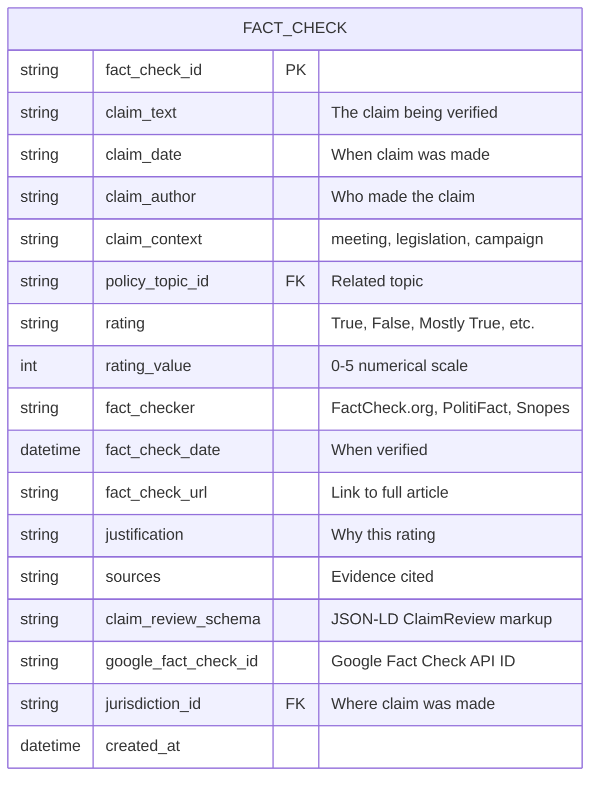

# Fact-Checking & Claim Verification

Official fact-checking sources for verifying claims made in government meetings, legislation, ballot measures, and political campaigns. Essential for accountability, transparency, and combating misinformation in civic engagement.

## 📊 Data Scale & Coverage

| Data Type | Source | Coverage | Cost |
|-----------|--------|----------|------|
| **Fact Checks** | FactCheck.org | National politics, major claims | Free (web scraping) |
| **Claim Ratings** | PolitiFact | Federal + state politics | Free (web scraping) |
| **ClaimReview Data** | Google Fact Check API | Aggregated from 100+ checkers | Free API |
| **Structured Data** | ClaimReview schema | Schema.org markup | Open standard |

---

## 🔍 Primary Data Sources

### 1. Google Fact Check Tools (ClaimReview) ⭐ **Most Comprehensive**

**Organization:** Google  
**URL:** https://toolbox.google.com/factcheck/explorer  
**API:** https://developers.google.com/fact-check/tools/api  
**Schema:** https://developers.google.com/search/docs/appearance/structured-data/factcheck

**What It Contains:**
- **Aggregated fact checks** from 100+ organizations worldwide
- **ClaimReview structured data** - Schema.org standard markup
- **Claims and ratings** - What was claimed, who checked it, verdict
- **Source URLs** - Links to full fact-check articles
- **ClaimReview appearance** - Google Search integration
- **Publisher information** - Which fact-checker verified the claim

**ClaimReview Schema Structure:**
```json
{
  "@context": "https://schema.org",
  "@type": "ClaimReview",
  "datePublished": "2024-03-15",
  "url": "https://factcheck.org/2024/03/fluoridation-claim/",
  "claimReviewed": "Water fluoridation causes cancer",
  "author": {
    "@type": "Organization",
    "name": "FactCheck.org"
  },
  "reviewRating": {
    "@type": "Rating",
    "ratingValue": 1,
    "bestRating": 5,
    "worstRating": 1,
    "alternateName": "False"
  },
  "itemReviewed": {
    "@type": "Claim",
    "author": {
      "@type": "Person",
      "name": "City Council Member",
      "sameAs": "https://example.com/profile"
    },
    "datePublished": "2024-03-10",
    "appearance": {
      "@type": "CreativeWork",
      "url": "https://city.gov/meetings/2024-03-10"
    }
  }
}
```

**Coverage:**
- ✅ **100+ fact-checking organizations** - FactCheck.org, PolitiFact, Snopes, AFP, Reuters, etc.
- ✅ **Global coverage** - US, UK, EU, Asia, Latin America
- ✅ **Multiple languages** - English, Spanish, French, German, etc.
- ✅ **All claim types** - Political, health, science, viral content
- ✅ **API access** - Free with API key (quota: 10,000 queries/day)

**Why We Use It:**
> "Google's Fact Check Explorer aggregates fact checks from trusted organizations worldwide, providing a single API to access verified claims with structured ClaimReview data."

**API Access:**

**Free API with quota:**
1. Get API key: https://console.cloud.google.com/apis/credentials
2. Enable Fact Check Tools API
3. Query endpoint: `https://factchecktools.googleapis.com/v1alpha1/claims:search`

**API Parameters:**
- `query` - Search term (e.g., "fluoridation", "school funding")
- `languageCode` - Language filter (e.g., "en")
- `pageSize` - Results per page (max 100)
- `reviewPublisherSiteFilter` - Specific fact-checker (e.g., "factcheck.org")

**How We Use It:**
```python
import requests

def search_fact_checks(claim_keyword, api_key):
    """Search Google Fact Check API for verified claims"""
    
    url = "https://factchecktools.googleapis.com/v1alpha1/claims:search"
    params = {
        'query': claim_keyword,
        'languageCode': 'en',
        'pageSize': 100,
        'key': api_key
    }
    
    response = requests.get(url, params=params)
    claims = response.json().get('claims', [])
    
    fact_checks = []
    for claim in claims:
        fact_check = {
            'claim_text': claim.get('text'),
            'claim_date': claim.get('claimDate'),
            'claim_author': claim.get('claimant'),
            'fact_checker': claim['claimReview'][0]['publisher']['name'],
            'rating': claim['claimReview'][0]['textualRating'],
            'fact_check_url': claim['claimReview'][0]['url'],
            'review_date': claim['claimReview'][0]['reviewDate'],
            'language': claim.get('languageCode', 'en')
        }
        fact_checks.append(fact_check)
    
    return fact_checks

# Example: Search for fluoridation claims
fluoride_checks = search_fact_checks('water fluoridation', 'YOUR_API_KEY')

# Output example:
# {
#   'claim_text': 'Water fluoridation causes cancer',
#   'claim_author': 'Anti-fluoride activist',
#   'fact_checker': 'FactCheck.org',
#   'rating': 'False',
#   'fact_check_url': 'https://factcheck.org/...',
#   'review_date': '2024-03-15'
# }
```

**Data Model Integration:**
```sql
CREATE TABLE fact_checks (
    fact_check_id TEXT PRIMARY KEY,
    claim_text TEXT NOT NULL,
    claim_author TEXT,
    claim_date DATE,
    fact_checker TEXT,  -- FactCheck.org, PolitiFact, etc.
    rating TEXT,        -- True, False, Mostly True, etc.
    rating_value INTEGER,  -- 1-5 scale
    fact_check_url TEXT,
    review_date DATE,
    claim_review_schema JSONB,  -- Full ClaimReview JSON-LD
    google_fact_check_id TEXT UNIQUE,
    policy_topic_id TEXT REFERENCES policy_topics(topic_id),
    jurisdiction_id TEXT REFERENCES jurisdictions(jurisdiction_id),
    created_at TIMESTAMP DEFAULT NOW()
);
```

---

### 2. FactCheck.org ⭐ **Most Trusted**

**Organization:** Annenberg Public Policy Center, University of Pennsylvania  
**URL:** https://www.factcheck.org/  
**Founded:** 2003

**What It Contains:**
- **Nonpartisan fact-checking** - No political bias
- **Detailed articles** - Full explanations with sources
- **SciCheck** - Scientific claims (health, climate, vaccines)
- **Debunking false claims** - Viral misinformation
- **Ask FactCheck** - Reader questions answered
- **Video fact-checks** - Visual explanations

**Coverage:**
- ✅ **Federal politics** - President, Congress, Supreme Court
- ✅ **State politics** - Major gubernatorial races, state legislation
- ✅ **Health claims** - Vaccines, fluoridation, medical policy
- ✅ **Science claims** - Climate, environment, technology
- ✅ **Viral content** - Facebook, Twitter, email chains
- ✅ **Historical claims** - Past events, statistics

**Rating System:**
FactCheck.org doesn't use a formal rating scale like PolitiFact. Instead, they:
- Explain what's true and what's false
- Provide context and nuance
- Link to original sources
- Update articles as new information emerges

**Why We Use It:**
> "FactCheck.org is the gold standard for nonpartisan fact-checking. Founded by the Annenberg Public Policy Center at UPenn, they have 20+ years of credibility and focus on thorough, source-based analysis."

**How We Use It:**
```python
import requests
from bs4 import BeautifulSoup

def scrape_factcheck_org(topic_keyword):
    """
    Scrape FactCheck.org for articles on a topic.
    Note: No official API, use respectful web scraping with rate limiting.
    """
    
    search_url = f"https://www.factcheck.org/?s={topic_keyword}"
    headers = {
        'User-Agent': 'Mozilla/5.0 (compatible; CivicEngagementBot/1.0)'
    }
    
    response = requests.get(search_url, headers=headers)
    soup = BeautifulSoup(response.content, 'html.parser')
    
    articles = []
    for article in soup.find_all('article', class_='post'):
        title = article.find('h2').text.strip()
        url = article.find('a')['href']
        date = article.find('time')['datetime']
        excerpt = article.find('div', class_='excerpt').text.strip()
        
        articles.append({
            'title': title,
            'url': url,
            'date': date,
            'excerpt': excerpt,
            'fact_checker': 'FactCheck.org',
            'source': 'factcheck.org'
        })
    
    return articles

# Example: Search for dental health claims
dental_checks = scrape_factcheck_org('dental health fluoride')
```

**Best Practices:**
- ✅ Respect robots.txt
- ✅ Rate limit requests (1 request per 2 seconds)
- ✅ Use Google Fact Check API when possible (includes FactCheck.org)
- ✅ Cache results to avoid repeated scraping

---

### 3. PolitiFact

**Organization:** Poynter Institute  
**URL:** https://www.politifact.com/  
**Founded:** 2007 (Pulitzer Prize winner, 2009)

**What It Contains:**
- **Truth-O-Meter ratings** - 6-point scale from True to Pants on Fire
- **Federal fact-checks** - President, Congress, federal agencies
- **State fact-checks** - All 50 states + DC
- **Local fact-checks** - Major cities and counties
- **Promises** - Tracking campaign commitments
- **Flip-O-Meter** - Politicians changing positions

**Truth-O-Meter Scale:**
1. **True** - The statement is accurate
2. **Mostly True** - Accurate but needs clarification
3. **Half True** - Partially accurate but missing context
4. **Mostly False** - Contains some truth but misleading
5. **False** - Not accurate
6. **Pants on Fire** - Ridiculously false, no truth

**Coverage:**
- ✅ **All 50 states** - State-specific PolitiFact editions
- ✅ **Presidential** - Comprehensive 2016, 2020, 2024 coverage
- ✅ **Congressional** - House and Senate members
- ✅ **Governors** - State executive claims
- ✅ **Ballot measures** - Proposition fact-checks
- ✅ **Viral claims** - Social media misinformation

**Why We Use It:**
> "PolitiFact's Truth-O-Meter provides a standardized 6-point scale that makes it easy to quantify claim accuracy. Their state editions enable local fact-checking coverage."

**How We Use It:**
```python
def scrape_politifact(state_code, topic_keyword):
    """
    Scrape PolitiFact for fact-checks in a specific state.
    Example: scrape_politifact('north-carolina', 'education')
    """
    
    url = f"https://www.politifact.com/{state_code}/statements/?q={topic_keyword}"
    
    response = requests.get(url)
    soup = BeautifulSoup(response.content, 'html.parser')
    
    fact_checks = []
    for statement in soup.find_all('div', class_='statement'):
        claim = statement.find('div', class_='statement__text').text.strip()
        rating = statement.find('img', class_='meter')['alt']  # True, False, etc.
        author = statement.find('a', class_='statement__source').text.strip()
        date = statement.find('div', class_='statement__date').text.strip()
        article_url = statement.find('a', class_='link')['href']
        
        # Convert rating to numerical value
        rating_values = {
            'True': 5,
            'Mostly True': 4,
            'Half True': 3,
            'Mostly False': 2,
            'False': 1,
            'Pants on Fire': 0
        }
        
        fact_checks.append({
            'claim_text': claim,
            'claim_author': author,
            'rating': rating,
            'rating_value': rating_values.get(rating, 0),
            'fact_check_url': f"https://www.politifact.com{article_url}",
            'fact_check_date': date,
            'fact_checker': f'PolitiFact {state_code.title()}',
            'state': state_code
        })
    
    return fact_checks
```

**Data Model Integration:**
```python
# Map PolitiFact ratings to standard scale
POLITIFACT_SCALE = {
    'Pants on Fire': {'value': 0, 'label': 'False'},
    'False': {'value': 1, 'label': 'False'},
    'Mostly False': {'value': 2, 'label': 'Mostly False'},
    'Half True': {'value': 3, 'label': 'Mixed'},
    'Mostly True': {'value': 4, 'label': 'Mostly True'},
    'True': {'value': 5, 'label': 'True'}
}
```

---

## 🎯 Use Cases for Open Navigator

### 1. **Verify Claims from Government Meetings**

**Goal:** Check if statements made during city council meetings are accurate

**Process:**
1. Extract claims from meeting transcripts using AI
2. Search Google Fact Check API for existing fact-checks
3. If not found, flag claim for manual verification
4. Display fact-check alongside meeting minutes

**Example:**
```python
# Meeting transcript analysis
meeting_claims = extract_claims_from_meeting(meeting_id)

# "City council member claimed: 'Fluoridation increases cancer risk by 30%'"
claim_text = meeting_claims[0]['text']

# Search for fact-checks
fact_checks = search_fact_checks(claim_text, api_key)

if fact_checks:
    # Found existing fact-check
    alert_advocates({
        'meeting_id': meeting_id,
        'claim': claim_text,
        'rating': fact_checks[0]['rating'],  # "False"
        'fact_checker': fact_checks[0]['fact_checker'],  # "FactCheck.org"
        'url': fact_checks[0]['fact_check_url']
    })
else:
    # No fact-check found, flag for review
    flag_for_manual_verification(claim_text)
```

---

### 2. **Track Misinformation Trends**

**Goal:** Identify which false claims are most common across jurisdictions

**Example:**
```sql
-- Most common false claims in government meetings
SELECT 
    claim_text,
    COUNT(DISTINCT jurisdiction_id) as jurisdiction_count,
    AVG(rating_value) as avg_rating,
    COUNT(*) as total_instances
FROM fact_checks
WHERE rating IN ('False', 'Pants on Fire')
    AND claim_context = 'government_meeting'
GROUP BY claim_text
ORDER BY jurisdiction_count DESC
LIMIT 10;

-- Output: "Fluoridation causes cancer" appears in 47 jurisdictions
```

---

### 3. **Score Jurisdictions on Accuracy**

**Goal:** Rate cities/counties based on accuracy of claims in meetings

**Example:**
```python
def calculate_accuracy_score(jurisdiction_id):
    """Rate jurisdiction based on fact-checked claims"""
    
    claims = get_fact_checks_for_jurisdiction(jurisdiction_id)
    
    if not claims:
        return None  # No data
    
    # Average rating (0-5 scale)
    avg_rating = sum(c['rating_value'] for c in claims) / len(claims)
    
    # Percentage of true/mostly true claims
    accurate_claims = [c for c in claims if c['rating_value'] >= 4]
    accuracy_percentage = (len(accurate_claims) / len(claims)) * 100
    
    return {
        'jurisdiction_id': jurisdiction_id,
        'avg_rating': avg_rating,
        'accuracy_percentage': accuracy_percentage,
        'total_claims_checked': len(claims),
        'grade': get_letter_grade(avg_rating)
    }

def get_letter_grade(avg_rating):
    """Convert rating to letter grade"""
    if avg_rating >= 4.5: return 'A'
    if avg_rating >= 3.5: return 'B'
    if avg_rating >= 2.5: return 'C'
    if avg_rating >= 1.5: return 'D'
    return 'F'
```

---

### 4. **Alert Advocates to False Claims**

**Goal:** Notify advocates when false claims are made in their area

**Example:**
```python
# Real-time monitoring
new_meeting = get_latest_meeting('ocd-division/country:us/state:nc/place:cary')

# Extract and fact-check claims
claims = extract_claims(new_meeting['transcript'])
for claim in claims:
    fact_checks = search_fact_checks(claim['text'])
    
    if fact_checks and fact_checks[0]['rating'] in ['False', 'Pants on Fire']:
        # Send alert to advocates
        send_alert({
            'jurisdiction': 'Cary, NC',
            'meeting_date': new_meeting['date'],
            'claim': claim['text'],
            'speaker': claim['speaker'],
            'rating': fact_checks[0]['rating'],
            'fact_check_url': fact_checks[0]['url'],
            'action': 'Contact city council to correct the record'
        })
```

---

## 📊 Data Availability Summary

| Source | Structured Data | API Access | Web Scraping | Cost | Coverage |
|--------|----------------|------------|--------------|------|----------|
| **Google Fact Check** | ✅ ClaimReview JSON | ✅ Free API | N/A | Free | 100+ orgs |
| **FactCheck.org** | ⚠️ Partial | ❌ No API | ✅ Allowed | Free | National |
| **PolitiFact** | ⚠️ Partial | ❌ No API | ✅ Allowed | Free | All 50 states |

**Recommendation:**
- Use **Google Fact Check API** as primary source (aggregates all major checkers)
- Fall back to **web scraping** for FactCheck.org and PolitiFact if needed
- Store ClaimReview JSON-LD for full structured data

---

## 🔗 Integration with Data Model

### FACT_CHECK Entity (Updated)



---

## 🚀 Implementation Roadmap

### Phase 1: Google Fact Check Integration (Priority)
- [ ] Create `scripts/extract_google_factchecks.py`
- [ ] Set up Google Cloud API credentials
- [ ] Query API for policy topics (fluoridation, education, health)
- [ ] Parse ClaimReview JSON-LD schema
- [ ] Save to `data/gold/factchecks_claim_reviews.parquet`

### Phase 2: Meeting Claim Extraction
- [ ] Use AI to extract claims from meeting transcripts
- [ ] Match claims against Google Fact Check database
- [ ] Flag unchecked claims for manual review
- [ ] Link fact-checks to specific meetings

### Phase 3: FactCheck.org & PolitiFact Scraping
- [ ] Build respectful web scrapers
- [ ] Rate limit to 1 request per 2 seconds
- [ ] Parse fact-check articles
- [ ] Supplement Google API data
- [ ] Save to `data/gold/factchecks_factcheck_org.parquet` and `data/gold/factchecks_politifact.parquet`

### Phase 4: Advocacy Alerts
- [ ] Real-time monitoring of new meetings
- [ ] Automated claim fact-checking
- [ ] Alert when false claims detected
- [ ] Provide talking points for advocates

---

## 📚 References & Credits

### Official Sources
- **Google Fact Check Tools** - https://toolbox.google.com/factcheck/explorer
- **Google Fact Check API** - https://developers.google.com/fact-check/tools/api
- **ClaimReview Schema** - https://developers.google.com/search/docs/appearance/structured-data/factcheck
- **FactCheck.org** - Annenberg Public Policy Center, University of Pennsylvania, https://www.factcheck.org/
- **PolitiFact** - Poynter Institute, https://www.politifact.com/

### Related Standards
- **Schema.org ClaimReview** - https://schema.org/ClaimReview
- **International Fact-Checking Network** - https://www.poynter.org/ifcn/

### Citation
When using fact-check data, cite as:

```
Google Fact Check Tools API. Google LLC. https://developers.google.com/fact-check/tools/api

FactCheck.org. Annenberg Public Policy Center, University of Pennsylvania. https://www.factcheck.org/

PolitiFact. Poynter Institute. https://www.politifact.com/
```

---

## 💡 Pro Tips

### Best Practices for Fact-Checking

1. **Verify the source**
   - Check fact-checker credibility
   - Look for Poynter IFCN certification
   - Prefer nonpartisan organizations

2. **Read the full article**
   - Don't rely on ratings alone
   - Understand the context
   - Note any caveats or updates

3. **Check publication date**
   - Facts can change over time
   - Look for updates to older fact-checks
   - Prefer recent verifications

4. **Cross-reference multiple checkers**
   - Different organizations may rate differently
   - Look for consensus
   - Note any disagreements

5. **Understand rating scales**
   - PolitiFact uses 6-point scale
   - FactCheck.org uses narrative explanations
   - Google aggregates various systems

### Automated Fact-Checking Workflow

```python
def automated_fact_check_workflow(meeting_transcript):
    """Complete automated fact-checking pipeline"""
    
    # Step 1: Extract claims
    claims = extract_claims_with_ai(meeting_transcript)
    
    # Step 2: Search Google Fact Check API
    verified_claims = []
    for claim in claims:
        fact_checks = search_fact_checks(claim['text'], api_key)
        
        if fact_checks:
            # Found existing fact-check
            verified_claims.append({
                'claim': claim,
                'fact_check': fact_checks[0],
                'status': 'verified'
            })
        else:
            # No fact-check found
            verified_claims.append({
                'claim': claim,
                'fact_check': None,
                'status': 'unverified'
            })
    
    # Step 3: Generate report
    report = generate_accuracy_report(verified_claims)
    
    # Step 4: Alert if false claims detected
    false_claims = [c for c in verified_claims 
                    if c['fact_check'] and c['fact_check']['rating'] in ['False', 'Pants on Fire']]
    
    if false_claims:
        send_advocacy_alert(false_claims)
    
    return report
```

---

**Related Documentation:**
- [Data Model ERD](./data-model-erd.md) - FACT_CHECK entity
- [Polling & Survey Sources](./polling-survey-sources.md) - Related opinion data
- [HuggingFace Datasets](./huggingface-datasets.md) - Where to publish fact-checks
