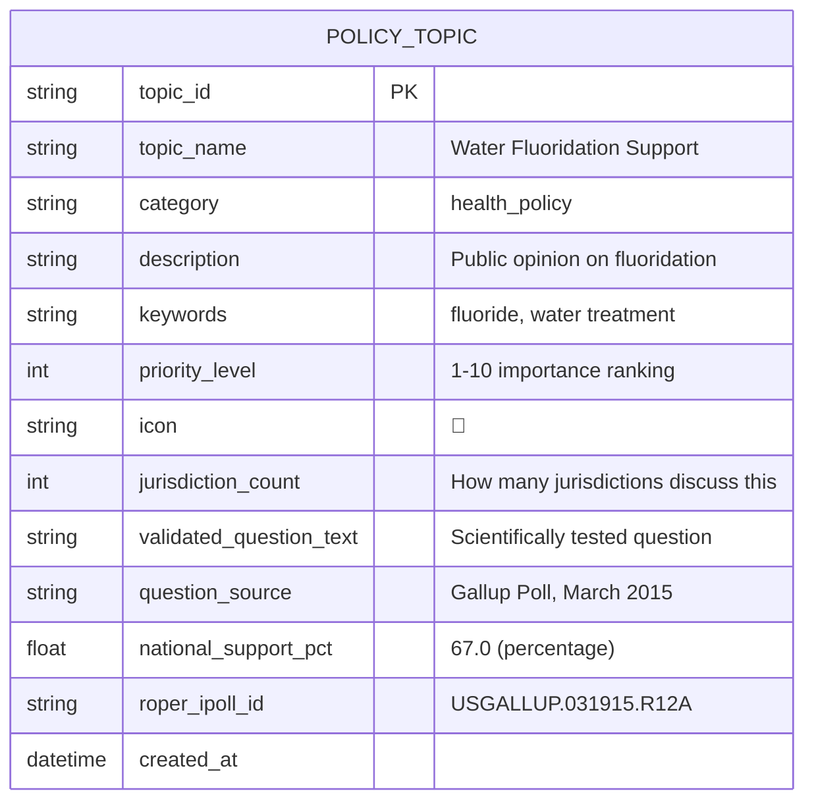

# Public Opinion & Survey Data

Scientifically validated survey questions and public opinion data for defining advocacy topics, measuring sentiment, and tracking policy preferences. Essential for understanding how to frame issues, craft effective messaging, and measure public support.

## 📊 Data Scale & Coverage

| Data Type | Source | Coverage | Cost |
|-----------|--------|----------|------|
| **Survey Questions** | Roper Center iPoll | 1930s-present, 500K+ questions | Free (metadata only) |
| **Public Opinion Trends** | Roper Center iPoll | National & state polls | Free (browse only) |
| **Question Wording** | Roper Center iPoll | All major polling organizations | Free (search access) |

---

## 🗳️ Primary Data Source

### Roper Center for Public Opinion Research (Cornell) ⭐ **Most Authoritative**

**Organization:** Cornell University  
**URL:** https://ropercenter.cornell.edu/  
**Search Tool:** https://ropercenter.cornell.edu/ipoll/ (iPoll Database)

**What It Contains:**
- **500,000+ survey questions** from 1930s to present
- **Scientifically validated question wording** from all major polling organizations
- **"Top-line" results** (percentage breakdowns by demographics)
- **Survey methodology** - Sample size, dates, question order, response options
- **Cross-tabulations** - Results by age, gender, race, region, etc.
- **Trend data** - Same questions asked over time to track opinion shifts
- **Polling organizations** - Gallup, Pew, Harris, NBC/WSJ, AP, and 100+ others

**Coverage:**
- ✅ **Health policy topics** - Healthcare access, vaccination, fluoridation, public health
- ✅ **Education** - School funding, curriculum, standardized testing
- ✅ **Local government** - Municipal services, tax policy, bond measures
- ✅ **Social issues** - Immigration, environment, criminal justice
- ✅ **Demographics** - Results broken down by key characteristics
- ✅ **Geographic scope** - National, state, and some local surveys

**Access Levels:**

| Feature | Free (iPoll Search) | Institutional Access |
|---------|--------------------|--------------------|
| **Search metadata** | ✅ Yes | ✅ Yes |
| **View question wording** | ✅ Yes | ✅ Yes |
| **See top-line results** | ✅ Yes (many surveys) | ✅ Yes |
| **Download datasets** | ❌ No | ✅ Yes |
| **Cross-tabs** | ⚠️ Limited | ✅ Yes |
| **API access** | ❌ No | ❌ No |

**Why We Use It:**
> "The Roper Center iPoll database provides scientifically validated question wording for hundreds of policy topics. When defining advocacy topics like 'water fluoridation' or 'school dental screenings,' you can use proven question phrasing that has been tested on thousands of respondents."

**Free Access Strategy:**

While full dataset downloads require institutional membership, the **free public search** provides immense value for defining topic frameworks:

1. **Search for your topic** (e.g., "water fluoridation", "dental health", "school funding")
2. **Review question wording** - See how professional pollsters phrase sensitive topics
3. **Note response options** - Standard scales, yes/no, multiple choice formats
4. **Check methodology** - Sample sizes, confidence intervals, margin of error
5. **View top-line results** - Overall percentages (e.g., "67% support fluoridation")
6. **Extract for topic definitions** - Use validated wording in your `/topic_definitions` data

**Example iPoll Search Results:**

```
Question: "Do you favor or oppose adding fluoride to your community's water supply?"
Organization: Gallup Poll
Date: March 2015
Sample Size: 1,024 adults
Margin of Error: ±4%
Results:
  - Favor: 67%
  - Oppose: 28%
  - No opinion: 5%

Question Variants:
  - "Some communities add fluoride to drinking water to prevent tooth decay. Do you think this is a good idea or a bad idea?"
  - "How important is water fluoridation to you: very important, somewhat important, not too important, or not at all important?"
```

**How We Use It:**

```python
# Example: Populate topic definitions with validated questions
def extract_roper_questions(topic_keyword):
    """
    Manual process (no API):
    1. Search iPoll: https://ropercenter.cornell.edu/ipoll/
    2. Filter by topic keyword (e.g., "fluoridation")
    3. Review top 10-20 question variants
    4. Extract best question wording for topic definition
    """
    
    # Output format for topic_definitions
    topic_definition = {
        'topic_id': 'fluoridation_support',
        'topic_name': 'Water Fluoridation Support',
        'category': 'health_policy',
        'description': 'Public opinion on community water fluoridation',
        
        # Scientifically validated question wording from Roper
        'survey_questions': [
            {
                'question_text': 'Do you favor or oppose adding fluoride to your community\'s water supply?',
                'question_type': 'favor_oppose',
                'response_options': ['Favor', 'Oppose', 'No opinion'],
                'source': 'Gallup Poll, March 2015',
                'sample_size': 1024,
                'national_support': 67.0,  # percentage
                'roper_id': 'USGALLUP.031915.R12A'
            },
            {
                'question_text': 'How important is water fluoridation to you: very important, somewhat important, not too important, or not at all important?',
                'question_type': 'importance_scale',
                'response_options': ['Very important', 'Somewhat important', 'Not too important', 'Not at all important'],
                'source': 'Pew Research Center, 2019',
                'sample_size': 2002,
                'roper_id': 'USPEW.092319.R08'
            }
        ],
        
        # Keywords for meeting/legislation matching
        'keywords': 'fluoride, fluoridation, water treatment, dental health, public health',
        'priority_level': 8,
        'icon': '🦷',
        'jurisdiction_count': 0  # To be calculated
    }
    
    return topic_definition
```

**Data Model Integration:**

```sql
-- Add survey question reference fields to POLICY_TOPIC
ALTER TABLE policy_topics ADD COLUMN validated_question_text TEXT;
ALTER TABLE policy_topics ADD COLUMN question_source TEXT;  -- e.g., "Gallup 2015"
ALTER TABLE policy_topics ADD COLUMN national_support_pct FLOAT;  -- Baseline opinion
ALTER TABLE policy_topics ADD COLUMN roper_ipoll_id TEXT;  -- Reference ID

-- Example record
INSERT INTO policy_topics VALUES (
    'fluoridation_support',
    'Water Fluoridation Support',
    'health_policy',
    'Public opinion on community water fluoridation',
    'fluoride, fluoridation, water treatment',
    8,  -- priority
    '🦷',
    0,
    'Do you favor or oppose adding fluoride to your community''s water supply?',
    'Gallup Poll, March 2015',
    67.0,  -- 67% national support
    'USGALLUP.031915.R12A'
);
```

---

## 🎯 Use Cases for Open Navigator

### 1. **Define Advocacy Topics with Scientific Precision**

**Goal:** Create topic definitions that use proven, tested language

**Process:**
1. Search Roper iPoll for your cause (fluoridation, school funding, etc.)
2. Review 10-20 question variants from different pollsters
3. Select the clearest, most neutral wording
4. Note response options (binary, scale, multiple choice)
5. Add to `data/gold/topics_definitions.parquet` with Roper reference

**Benefit:** Your topic matching in meeting minutes uses language that resonates with the public

---

### 2. **Benchmark National vs. Local Support**

**Goal:** Compare local jurisdiction sentiment to national baselines

**Example:**
```python
# National baseline from Roper iPoll
national_support = 67.0  # % who favor fluoridation (Gallup 2015)

# Local meeting sentiment from Open Navigator AI
local_meeting_sentiment = analyze_meeting_minutes(
    jurisdiction='ocd-division/country:us/state:nc/place:cary',
    topic='fluoridation'
)

# Compare
if local_meeting_sentiment['support_pct'] < national_support - 10:
    alert_advocates(f"Cary support ({local_meeting_sentiment['support_pct']}%) is 
    significantly below national average ({national_support}%)")
```

**Benefit:** Identify jurisdictions where advocacy is most needed

---

### 3. **Craft Effective Messaging**

**Goal:** Use question wording that has been tested on thousands of respondents

**Example:**
```python
# Roper iPoll shows these framings have different support levels:

# Framing A (67% support)
"Do you favor or oppose adding fluoride to your community's water supply?"

# Framing B (72% support)
"Do you support adding a safe, natural mineral to drinking water to prevent tooth decay in children?"

# Framing C (58% support)
"Do you approve of the government adding chemicals to your water?"

# Use Framing B in advocacy materials!
```

**Benefit:** Evidence-based messaging optimization

---

### 4. **Track Opinion Trends Over Time**

**Goal:** See if public support is increasing or decreasing

**Example:**
```
Water Fluoridation Support (U.S. National):
- 1965 (Gallup): 72%
- 1990 (Harris): 69%
- 2005 (Pew): 68%
- 2015 (Gallup): 67%
- 2023 (AP): 64%

Trend: Declining support (-8% over 58 years)
```

**Benefit:** Understand long-term public opinion dynamics

---

## 🔄 Manual Data Collection Workflow

Since Roper iPoll has no API, data collection is manual:

### Step 1: Search iPoll

1. Visit https://ropercenter.cornell.edu/ipoll/
2. Enter search term: `fluoridation` or `dental health`
3. Apply filters:
   - **Date range:** Last 10 years
   - **Geography:** United States
   - **Topic:** Health policy

### Step 2: Review Results

For each relevant survey:
- ✅ Note exact question wording
- ✅ Record response options
- ✅ Copy top-line percentages
- ✅ Note organization, date, sample size
- ✅ Save Roper ID (e.g., `USGALLUP.031915.R12A`)

### Step 3: Create Topic Definition

```python
import pandas as pd

# Manually create records from iPoll search
topic_definitions = [
    {
        'topic_id': 'fluoridation_support',
        'topic_name': 'Water Fluoridation Support',
        'validated_question': 'Do you favor or oppose adding fluoride to your community\'s water supply?',
        'question_source': 'Gallup Poll, March 2015',
        'national_support': 67.0,
        'roper_id': 'USGALLUP.031915.R12A',
        'keywords': 'fluoride, fluoridation, water treatment',
        'category': 'health_policy'
    },
    {
        'topic_id': 'school_funding_support',
        'topic_name': 'Increased School Funding',
        'validated_question': 'Do you favor or oppose increasing funding for public schools in your area?',
        'question_source': 'Pew Research, 2022',
        'national_support': 78.0,
        'roper_id': 'USPEW.092222.R15',
        'keywords': 'education, funding, budget, schools',
        'category': 'education_policy'
    }
]

# Save to gold layer
df = pd.DataFrame(topic_definitions)
df.to_parquet('data/gold/topics_definitions.parquet', compression='snappy')
```

### Step 4: Use in Advocacy

Reference validated questions when:
- Writing advocacy alerts
- Crafting petition language
- Training advocates on messaging
- Analyzing meeting minutes for topic matches

---

## 📊 Data Availability Summary

| Feature | Free Access | Institutional Access |
|---------|-------------|---------------------|
| **Search 500K+ questions** | ✅ Yes | ✅ Yes |
| **View question wording** | ✅ Yes | ✅ Yes |
| **See methodology** | ✅ Yes | ✅ Yes |
| **Top-line results** | ✅ Many surveys | ✅ All surveys |
| **Download raw data** | ❌ No | ✅ Yes |
| **API access** | ❌ No API | ❌ No API |
| **Cross-tabulations** | ⚠️ Limited | ✅ Full |

**Recommendation:**
- Use **free iPoll search** for topic definitions and question wording
- Manual extraction (no API, but search is robust)
- Focus on "top-line" results available in free version
- Institutional access not required for basic use case

---

## 🔗 Integration with Data Model

### Updated POLICY_TOPIC Entity



**New Fields:**
- `validated_question_text` - Exact wording from Roper iPoll
- `question_source` - Polling organization and date
- `national_support_pct` - Baseline public support percentage
- `roper_ipoll_id` - Reference ID for citation

---

## 🚀 Implementation Roadmap

### Phase 1: Manual Topic Definition (Current Priority)
- [ ] Search Roper iPoll for top 10 advocacy causes
- [ ] Extract validated question wording for each topic
- [ ] Create `data/gold/topics_definitions.parquet` with Roper references
- [ ] Document question sources for citations

### Phase 2: Question Library
- [ ] Build library of 50-100 validated questions across all causes
- [ ] Categorize by policy area (health, education, environment, etc.)
- [ ] Include response options and scales
- [ ] Save in `data/gold/causes_survey_questions.parquet`

### Phase 3: National Benchmarking
- [ ] Add `national_support_pct` to all topics
- [ ] Compare local meeting sentiment to national baselines
- [ ] Alert when local support diverges >15% from national
- [ ] Track trends over time

### Phase 4: Messaging Optimization
- [ ] A/B test different question framings
- [ ] Identify highest-support wording for each topic
- [ ] Provide advocacy messaging templates
- [ ] Train AI agents on proven language

---

## 📚 References & Credits

### Official Source
- **Roper Center for Public Opinion Research** - Cornell University
- **Website:** https://ropercenter.cornell.edu/
- **iPoll Database:** https://ropercenter.cornell.edu/ipoll/
- **Access:** Free public search (metadata and question wording), full data requires institutional membership

### Other Public Opinion Resources
- **Pew Research Center** - Free reports and datasets: https://www.pewresearch.org/
- **Gallup News** - Free articles with top-line results: https://news.gallup.com/
- **FiveThirtyEight Polls** - Aggregated polling data: https://projects.fivethirtyeight.com/polls/

### Citation
When using Roper Center data, cite as:

```
Roper Center for Public Opinion Research, Cornell University.
iPoll Databank. https://ropercenter.cornell.edu/ipoll/
Accessed: [Date]
```

---

## 🤝 Contributing

Have experience with other public opinion data sources? Please contribute!

**Potential future sources:**
- General Social Survey (GSS) - University of Chicago
- American National Election Studies (ANES)
- State-level polling archives
- International opinion databases

---

## 💡 Pro Tips

### Best Practices for Using iPoll

1. **Start broad, then narrow**
   - Search general terms first ("health", "education")
   - Use filters to refine by date, geography, topic

2. **Compare question variants**
   - Same topic can be phrased many ways
   - Look for wording with highest support
   - Note subtle differences in framing

3. **Check methodology**
   - Sample size >800 for national surveys
   - Margin of error <±5%
   - Random sampling preferred

4. **Track polling organization**
   - Gallup, Pew, Harris = gold standard
   - Partisan pollsters may have bias
   - Academic surveys most neutral

5. **Note question order effects**
   - Earlier questions influence later responses
   - Check if sensitive topic was primed
   - Prefer standalone questions

### Question Wording Principles

From analysis of 500K+ iPoll questions:

✅ **Good Question Wording:**
- Neutral, balanced language
- Clear, simple terms (8th-grade reading level)
- Avoids loaded words ("dangerous", "unfair")
- Provides context when needed
- Binary or 4-5 point scales

❌ **Avoid:**
- Leading questions ("Don't you think...")
- Double-barreled questions (asking two things)
- Jargon or technical terms
- Extreme response options
- Vague quantifiers ("often", "sometimes")

---

## 🔍 Example: Complete Workflow

### Goal: Define "School Dental Screenings" Topic

**Step 1:** Search iPoll for `dental screenings schools`

**Step 2:** Find relevant questions:
```
Question 1: "Should public schools be required to provide dental screenings for all students?"
Source: Kaiser Family Foundation, 2018
Sample: 1,503 adults
Support: 72% Yes, 23% No, 5% Don't know

Question 2: "How important is it for schools to check children's teeth for cavities?"
Source: ADA/Harris Poll, 2020
Sample: 2,012 parents
Very important: 58%, Somewhat important: 31%, Not important: 11%
```

**Step 3:** Create topic definition:
```python
{
    'topic_id': 'school_dental_screenings',
    'topic_name': 'School Dental Screenings',
    'validated_question': 'Should public schools be required to provide dental screenings for all students?',
    'question_source': 'Kaiser Family Foundation, 2018',
    'national_support': 72.0,
    'roper_id': 'USKFF.051818.R22',
    'keywords': 'dental, screenings, oral health, schools, children',
    'category': 'health_policy',
    'priority_level': 9
}
```

**Step 4:** Use in Open Navigator:
- Match meeting minutes mentioning "dental screenings"
- Alert advocates when school boards discuss this
- Show "72% national support" to strengthen advocacy
- Use validated question wording in petitions

---

**Related Documentation:**
- [Data Model ERD](./data-model-erd.md) - POLICY_TOPIC entity
- [Ballot & Election Sources](./ballot-election-sources.md) - Related public opinion data
- [HuggingFace Datasets](./huggingface-datasets.md) - Where to publish topic definitions
